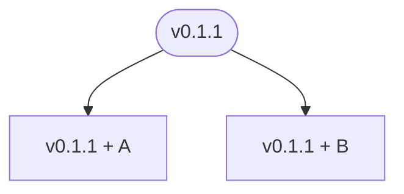
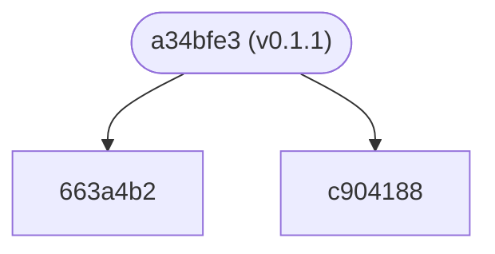
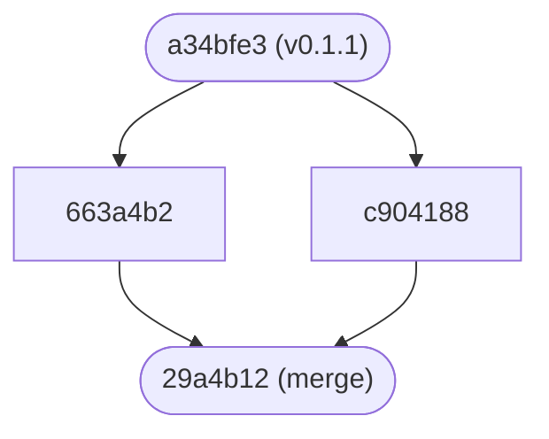
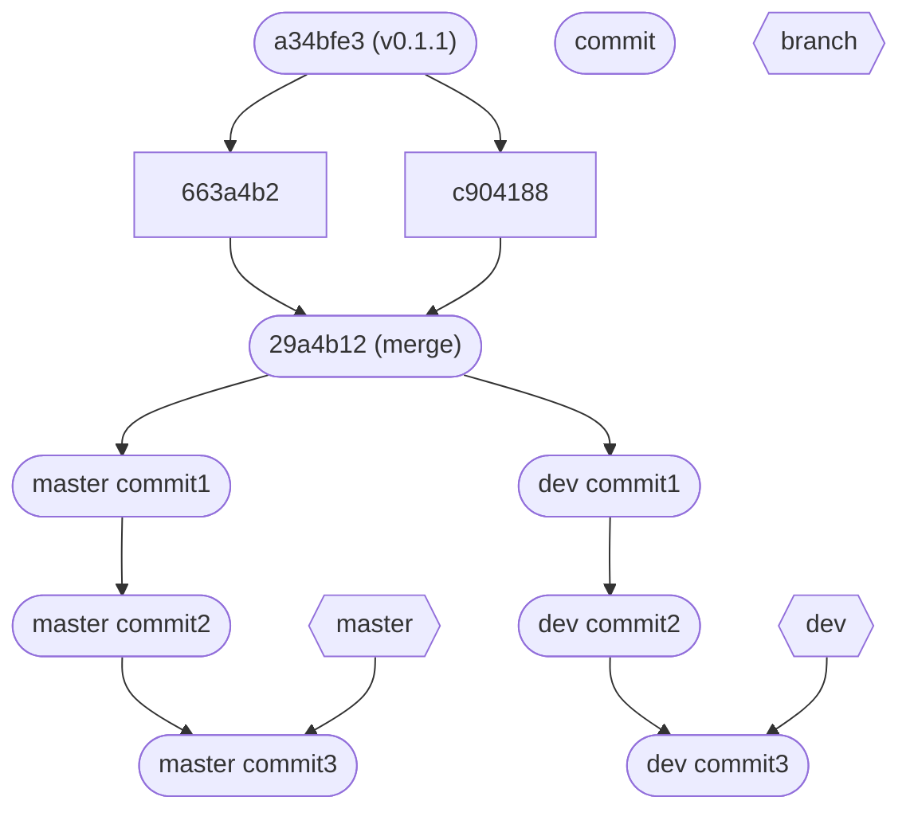
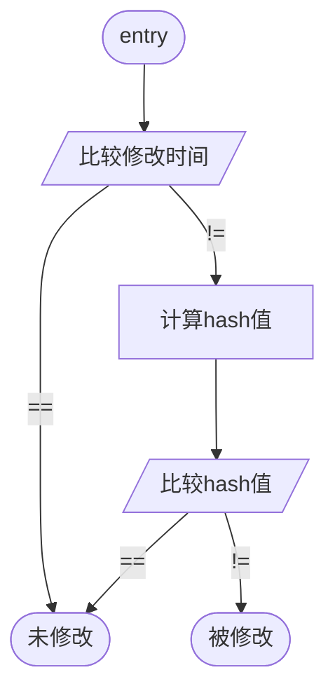
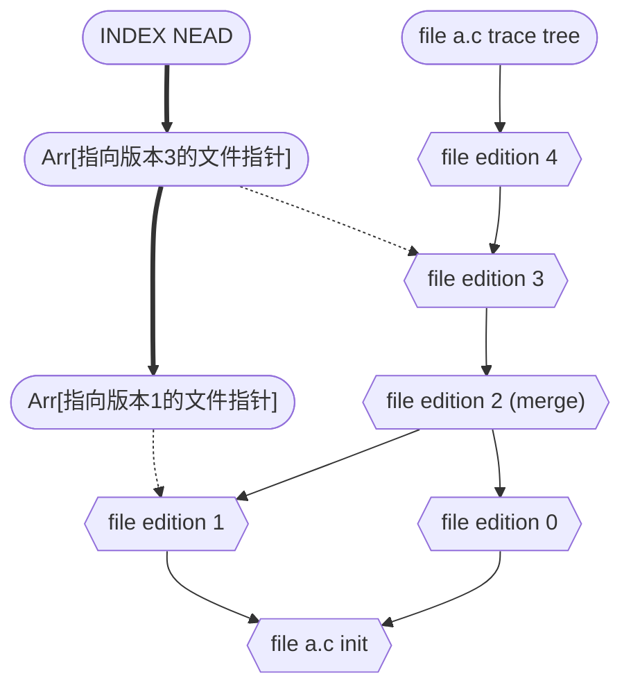

[git](https://git-scm.com/about) 是一个版本控制工具, 具有: 开销小, 速度快, 分布式, 高安全性, 自由免费的特点.

## 什么是版本控制

版本: 对工程文件的每一次保存都可以算作一个版本的记录, 例如vscode自带的 timeline, 对psd文件的每一次备份等. 小到每一次修改, 大到每一次发布的版本, 都是版本的一种.  

- 哪些版本需要管理?  
- 虽然每次保存都会产生一个新的版本, 但是如果所有版本都被纳入管理, git记录就会变的非常臃肿. 因此, 一般来说, git的版本管理遵循最小事务原则, 即一次最小的有意义的完整改动, 被视为一次记录修改.

## 作用

### I. 协作

假设 a, b 两人现在手上都有一个 `v0.0.1` 的项目代码, 此时 a 在 `v0.0.1` 之上修复了一个 `bug` , b 在 `v0.0.1` 之上新增了一个功能, 此时



此时为两个版本取一个有意义的版本号显然并无太大意义, 一般要达到一定规模的修改, 才会发布一个新的版本号, 因此, `git` 会自动产生一个用于标识的 `hash` 值 (如: 663a4b235fe3df41c406346a80660ad4b5beb610 或简写为 `663a4b2`).



之后如果我们需要将 a, b 两人的代码合并, 可以选择搭建一个仓库服务器, 服务器上记录了项目的所有历史版本: 即 `git` 记录. a, b 将自己的修改添加到服务器的 `git` 记录上. 此时其他项目参与者便可以看到 a, b 两人的提交. `git` 内置了一个差异合并算法, 如果两人的代码没有 `冲突(conflict)` 则可以完成自动 `合并(merge)`, 否则需要手动处理 `冲突(conflict)` 的代码. `merge` 时会默认创建一个 `merge` 节点.



此时就完成了一次分布式的代码协作.

### II. 方便开源托管

追溯历史 `git` 诞生于 `linux` 项目, 为了方便大家都能获取到最新的代码, `linus` 花了 3个月 开发了 `git`, 如前所述, `git` 具有分布式的特点, 每个人都可以方便的将自己本地的项目和服务器上最新的代码进行同步.

### III. 版本回退

`git` 会保留历史所有的提交记录(除非手动删除), 万一某天发现了一个bug, 可以方便的通过 git 进行版本回退, 减少损失. 相当于一个备份系统.

### IV. 分支管理

每个版本在 `git` 中都是一个节点, 因此我们可以通过一个指针指向一个节点, 这便是分支:



`master` 分支的维护和 `dev` 分支的新特性开发可以同步进行, 都通过同一个 `git` 仓库进行管理, 可以随时通过 `git` 切换当前的头结点(当前的工作区版本). 


## How to Use

### I. 暂存区

在本地工作区和 `git` 版本树之间还有一个暂存区, 将代码添加到版本树之前, 要将工作区的版本先添加到暂存区, 这样做可以:  

1. 避免将一些不应提交的数据提交到版本树(上传之后非管理员无法撤销).
2. 同时修改了多个文件, 可以分批添加到暂存区, 分批添加到版本树, 使得提交记录更清晰.

### II. 常用指令

``` sh
    git add ./path_or_file          # 将工作区的文件(夹)添加到暂存区
    git commit -m "commit message"  # 将暂存区的文件(夹)提交到版本树
    git commit --amend              # 覆盖 HEAD 分支提交
    git branch [--option]           # 创建/删除/查看 分支
    git checkout branch_name        # 签出分支(将)工作区和暂存区的版本同步为版本树中的指定分支
    
    # 重置 [工作区和暂存区/仅暂存区] 回当前 HEAD, commit_lable 可以为 HEAD^^^, 表示 HEAD 的前驱
    git reset [--hard/mixed] commit_lable
    git merge another_branch        # 将 another_branch 合并到当前分支
    git rebase commit_lable         # 将当前分支的 HEAD 和当前暂存区的版本设置为 commit_lable

    git push                        # 将当前分支(例如: dev)提交到远程(origin/dev)分支
    git pull                        # 拉取远程仓库合并到本地
    # 克隆远程仓库(可选只克隆最新的n个版本, 可选指定分支, --recursive拉取子模块)
    git clone [--depth=n] [-b branch] [--recursive] url
    git submodule update            # 更新子模块
```

### III. Advanced Usage

**STFW and RTFM**


## [Github](https://github.com/)

- ~~全球最大的同性交友网站~~

之前提到 `git` 是一个分布式的项目版本管理器, 可以托管在远程仓库里, `github` 就是其中最大的托管平台, 它提供了许多高效的协作工具(issue, fork, pull requirest...), 吸引了众多开源工作者.

1. 注册
2. 在github上创建一个test仓库
3. 本地拉取 test 仓库
4. 往里添加一个 readme
5. 两个人相互给对方仓库(仓库所有者称为a, b想给a的仓库添加代码):
   1.  `b` 提一个issue
   2.  `b` fork and clone 对方的仓库
   3.  `b` 在本地创建新的分支
   4.  `b` 在本地新分支上修改代码
   5.  `b` push 到自己 fork 的仓库
   6.  `b` Create pull request
6. `a` 合并new branch
7. `a` 给 `b` 仓库管理权限
8. `b` 不通过 fork, pr 直接添加代码

- enjoy opensource world :heart:

## How Does `Git` Work

### 如何判断文件是否修改

- 这个问题在计算机各类工具软件中非常常见: 如 makefile 等构建工具, 文件服务器等.

`git` 会对项目目录下的所有纳入管理的文件(夹)计算一个 hash 值, 其中文件夹的 hash 值通过包含成员的 hash 值二次计算而来, 同时还会保存一个最近一次更改的时间. 如果工作区 a.c 文件最近更改的时间与 git 记录的(暂存区/版本树)时间不同, 则会对 a.c 重新计算一个 hash 值, 如果计算得到的 hash 值与 git 记录的 hash 值不同, 则改文件被认为修改过.



### 如何将新文件加入到暂存区/版本树

首先 `git` 会将工作区的文件和暂存区的文件比较差异, 有修改的文件会被标识. 被标识的文件的 hash值, 修改时间 和 `zstd` 压缩后的文件会被加密存放到 `.git` 文件夹下.

以上过程不难看出, `git` 每次提交只记录了差异文件, 但是 `git` 需要知道每个文件的最新版本. 方法是, 将文件单独作为元数据保存, 每个 commit 节点, 记录每个文件最新版本的元数据指针.  

