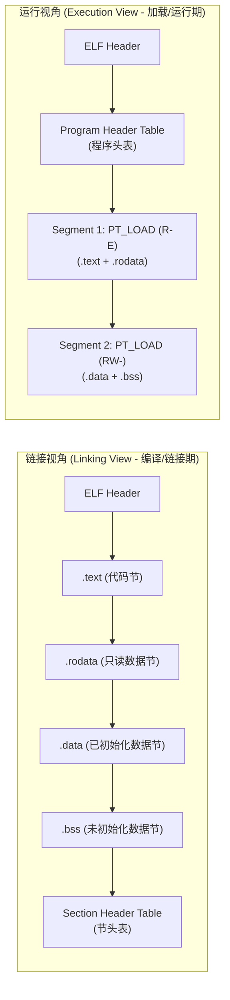

## 一. 本章概览

本章从“怎样为没有操作系统的机器编写程序”开始，接触到 RISC-V 汇编、ABI、ELF 和链接脚本：编译器按照 ABI 生成目标文件，链接器为代码和数据安排地址，模拟器加载最终的 ELF，启动代码再把控制权交给 `main`。最终任务是移植一个自选程序。

## 二. 从源码到 ELF

裸机程序从源码到执行大致经过下面的过程：

```text
C / Assembly
     │  编译、汇编
     ▼
Relocatable Object Files（.o，ELF 格式）
     │  链接，由 linker.ld 决定地址和 section 布局
     ▼
Executable ELF
     │  emulator 将其中的可加载段载入 RAM
     ▼
_start
```

编译器和汇编器生成若干目标文件，链接器合并所有目标文件——解析函数和全局变量的引用，并按照 linker script 生成具有最终地址的可执行目标文件。`HERE` 会根据 ELF 中的可加载段把内容写入 RAM。

本项目中的 CPU 初始 PC 默认是 `0x8000_0000`，因此 linker script 会把启动代码安排到这个位置。

## 三. 极简 RISC-V 汇编导读

GNU ASM 汇编文件通常由 label、指令和 assembler directive（伪指令）组成：

```asm
.section .text.ENTRY
.globl main

main:
    # 分配栈空间并保存 ra、s0
    addi sp, sp, -16
    sd   ra, 8(sp)
    sd   s0, 0(sp)

    li   s0, 0              # 用 s0 作计数器，printf 保证不会修改 s0

1:
    la   a0, msg            # 传入字符串地址
    call printf

    addi s0, s0, 1
    li   t1, 10
    bne  s0, t1, 1b

    li   a0, 0              # main 函数返回值 0

    # 恢复寄存器并返回
    ld   s0, 0(sp)
    ld   ra, 8(sp)
    addi sp, sp, 16
    ret

.section .rodata
msg:
    .asciz "Hello, world!\n"
```

> [!TIP]
> 你可以先尝试阅读该代码，之后可以将代码保存为 `a.S`，然后使用 `riscv64-unknown-elf-gcc a.S -o a.elf && qemu-riscv64 ./a.elf` 运行以上代码，查看实际输出与你的预期是否一致。

`main:` 和 `msg:` 是标号（label），`1:` 是局部数字标号，代表当前位置的地址。`la`、`call` 和 `ret` 是 RISC-V 汇编指令或伪指令（pseudo instruction）。以 `.` 开头的行通常是汇编器伪指令（directive），由汇编器处理，本身并不是 CPU 的指令。

数字标号适合在一小段汇编中重复使用。`1f`（forward）表示向后寻找下一个 `1:`，`1b`（backward）表示向前寻找最近的 `1:`；`boot.S` 中就使用了这种写法。

ABI 约定解释了函数之间如何配合：参数和返回值放在哪些寄存器，哪些寄存器需要跨调用保存，栈指针如何移动，返回地址怎样传递。C 与汇编混合调用、函数返回到错误位置或栈内容异常时，都可以沿着这些约定检查。

RISC-V 的寄存器名字简洁易懂：

- `zero` 始终读出零；`ra` 是返回地址；`sp` 是栈指针。
- `a0`～`a7` 用于函数参数和返回值。
- `t0`～`t6` 是临时寄存器，函数调用后内容可以改变（调用者保存）。
- `s0`～`s11` 是保存寄存器，使用它们的函数在退出前要恢复原值（被调用者保存）。

`li`、`la`、`mv`、`call` 和 `ret` 等伪指令让汇编更容易阅读，这些指令并不存在于真实处理器上，而是由汇编器根据操作数把它们展开成一条或多条真实指令。

## 四. ELF 文件格式与链接脚本

在裸机开发中，从源码编译出的各种目标文件（`.o`）最终必须被组合为一个符合规范的 **ELF（Executable and Linkable Format）** 二进制可执行文件，而 **Linker Script（链接脚本）** 则负责精确指挥这一排布与映射过程。

### 1. ELF 文件格式基础

ELF 是类 Unix 操作系统以及嵌入式/裸机系统中最主流的通用二进制文件格式。无论是可重定位目标文件（`.o`）、静态库/动态库（`.a`/`.so`），还是最终的可执行程序（`.elf`），都遵循 ELF 规范。

#### 1.1. ELF 的双重视角（Dual Views）

ELF 规范定义了两种不同的组织视图：



1. **链接视角（Linking View）—— 以 Section（节）为单位**：
   - 面向编译器与链接器。汇编文件中的伪指令（如 `.section .text.ENTRY`、`.section .rodata`）指示汇编器将接下来的代码或数据归入特定的 Section。
   - **`.text`**：编译后的 CPU 机器指令（代码段）。
   - **`.rodata`**：只读常量数据（如字符串字面量、常数表）。
   - **`.data`**：已初始化的全局变量和静态变量。
   - **`.bss`**：未初始化的全局变量和静态变量（在 ELF 文件中**不占用实际存储空间**，仅记录所需内存大小，加载后由启动代码清零）。
   - **Section Header Table（节头表）**：记录文件中每个 Section 的名称、类型、文件偏移、内存地址及读写执行属性。

2. **运行视角（Execution View）—— 以 Segment（段）为单位**：
   - 面向操作系统加载器（Loader）或模拟器（如本项目中的 `HERE` 模拟器）。
   - **Program Header Table（程序头表）**：描述了系统如何将文件内容映射到物理内存中。表中类型为 **`PT_LOAD`** 的可加载段记录了虚拟/物理加载地址（`p_paddr`/`p_vaddr`）、文件大小（`p_filesz`）、内存大小（`p_memsz`）和权限标志（`p_flags`，如读/写/执行）。
   - 通常，属性相同的多个 Section 会被合并归入同一个 Segment（例如只读的 `.text` 和 `.rodata` 归入一个只读代码段，可读写的 `.data` 和 `.bss` 归入一个数据段），以减少内存对齐与映射开销。

> [!TIP]
> 想深入探讨 ELF 文件结构与装载机制，可以 [问 AI：深入理解 ELF 文件格式、Section 与 Segment 的区别以及装载过程](https://kimi.moonshot.cn/_prefill_chat?prefill_prompt=详细解释ELF文件格式结构,ELFHeader,ProgramHeaderTable与SectionHeaderTable的区别,LinkingView与ExecutionView,以及模拟器或操作系统如何解析并装载ELF到内存&send_immediately=false&force_search=true)

#### 1.2. 模拟器如何加载 ELF 文件到 RAM

当你在终端运行 `cargo run --release -- ./test_resources/bin/main.elf` 时，模拟器的 ELF 加载模块执行以下核心流程：
1. **读取并校验 ELF Header**：验证开头的魔数（Magic: `0x7f 'E' 'L' 'F'`）、确认目标体系结构为 RISC-V 64 位、提取程序入口地址 **`e_entry`**（默认设置为 `0x8000_0000`）。
2. **遍历 Program Header Table**：找到所有类型为 `PT_LOAD` 的可加载段。
3. **搬运数据到 RAM**：将文件中偏移量 `p_offset` 处的 `p_filesz` 字节数据直接拷贝到模拟器虚拟物理内存 `p_paddr` 对应的物理地址中（RAM 从 `0x8000_0000` 开始）。
4. **初始化 BSS 空间**：若 `p_memsz > p_filesz`，将超出文件大小的内存空间在 RAM 中初始化清零。
5. **初始化 CPU 状态**：将 CPU 的初始程序计数器（`pc`）设置为 `e_entry`，开始从启动代码 `_start` 处逐周期执行指令。

常用 ELF 检查与分析命令：

```bash
# 查看 ELF Header（包含魔数、架构、程序入口地址 e_entry 等）
riscv64-unknown-elf-readelf -h bin/main.elf

# 查看 Program Headers（Segments 可加载段及其内存映射地址）
riscv64-unknown-elf-readelf -l bin/main.elf

# 查看 Section Headers（各个节区的名称、大小与属性）
riscv64-unknown-elf-readelf -S bin/main.elf

# 按地址顺序列出所有函数与全局变量的符号地址
riscv64-unknown-elf-nm -n bin/main.elf

# 反汇编可执行文件中的机器指令
riscv64-unknown-elf-objdump -d -M no-aliases bin/main.elf
```

---

### 2. Linker Script（链接脚本）

Linker Script 描述各个输入目标文件（`.o`）中的 section 怎样组合并布局到最终 ELF 的内存地址空间中。`test_resources/linker.ld` 的核心结构可以简化为：

```ld
SECTIONS {
    . = 0x80000000;

    .text : {
        *(.text.ENTRY)
        *(.text .text.*)
    }

    .rodata : { *(.rodata .rodata.*) }
    .data   : { *(.data .data.*) }
    .bss    : { *(.bss .bss.*) }
    .stack  : { *(.stack) }
}
```

关键语法与工作机制：

- **`.`（Location Counter，定位计数器）**：表示当前输出地址；把它设为 `0x8000_0000`，后续 section 就会从 Virt Board 的 RAM 起始位置开始依次排列。
- **`.text : { ... }`**：定义一个输出 section；`*(.text .text.*)` 通配收集所有输入目标文件中匹配的 section。
- **`*(.text.ENTRY)`**：写在普通 `.text` 之前，确保 `boot.S` 中的启动入口代码（`_start`）被优先放置在 `0x8000_0000` 最前端。
- **`ALIGN(...)`**：按照指定的字节对齐要求向前推进 location counter。

linker script 负责规划 ELF 在地址空间的静态布局，并不负责运行时的动态初始化。例如，它可以在脚本中为 `.bss` 和 `.stack` 安排地址空间并导出边界符号（如 `_bss_start`、`_bss_end`、`_stack_top`），而真正设置栈指针 `sp`、清零 `.bss` 内存或跳转调用 `main()` 的初始化工作仍然由 `boot.S` 启动汇编代码完成。

## 五. MMIO

本章你可能会使用的内存区域如下：

| 区域          | 基地址        | 用途                                 |
| ------------- | ------------- | ------------------------------------ |
| power manager | `0x0010_0000` | 结束模拟器运行                       |
| UART          | `0x1000_0000` | 终端输入输出                         |
| CLINT         | `0x0200_0000` | 定时器与软件中断（mtime / mtimecmp） |
| RAM           | `0x8000_0000` | ELF 加载和程序运行区域               |

UART 的发送和接收状态都通过寄存器体现。最简单的应用方式：输出字符时，程序轮询发送状态并写入数据寄存器；输入字符时，交互程序可以轮询接收状态。模拟器的终端桥接会把宿主按键送入 UART，并把 UART 输出写回终端。

如果你需要在裸机程序中使用定时器中断或操作系统类功能，请参考 Chapter 0x04 中的异常处理和特权级内容。


## 六. 项目导览

1. `test_resources/src/boot.S`：裸机程序的入口、栈初始化和进入 `main` 的过程。
2. `test_resources/linker.ld`：程序在 RAM 中的布局，RAM 默认从 `0x8000_0000` 开始。
3. `test_resources/Makefile`：编译参数、目标文件和 linker script 怎样组合成 ELF。
4. `test_resources/lib/io.c`：客户程序如何通过 UART 完成输入输出。
5. `test_resources/lib/power.c`：客户程序如何结束模拟器运行。

## 七. 调试程序

参阅 [Ch0.2](./Ch0.2.md) `Debugger` 章节，来了解如何调试模拟器中运行的程序。

```bash
# 请使用 --release 来提高运行 emulator 本身的运行速度
cargo run --release -- /path/to/program -g
```

## 八. 实践：移植一个自选裸机程序

选择一个自己感兴趣、适合在裸机环境运行、在终端中呈现的程序，将它移植到 `HERE` 模拟器上。终端小游戏、简易计算器、Shell 命令解释器和单步推进的算法可视化演示都可以作为方向。强烈推荐大家将大一《计算思维》等课程中写过的经典 C 语言小程序移植到 RISC-V 裸机环境运行！
