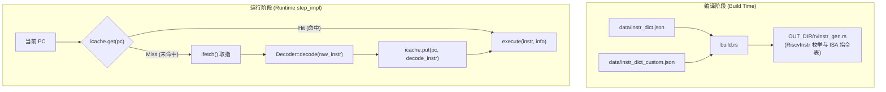
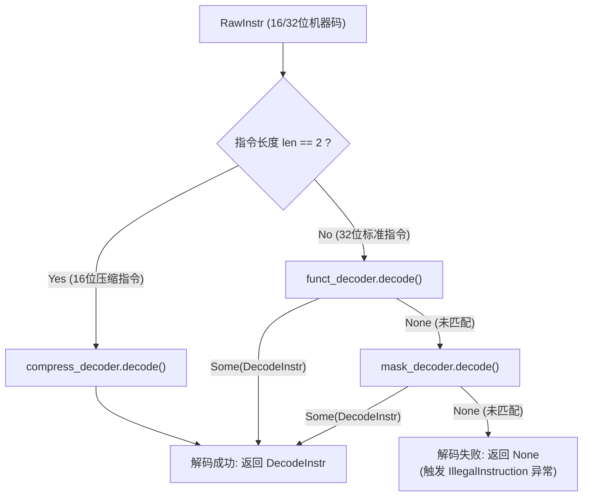

[REPO]: https://github.com/here-emulator/here

## 本章概览

本章将深入 RISC-V 体系结构的**指令编码规范**与模拟器的**前端译码/执行架构**。模拟器如何从一段二进制指令数据中，快速且准确地识别出指令类型、提取操作数（寄存器编号、立即数），并最终分发给后端执行逻辑，是理解处理器硬件设计与模拟器实现的核心。

通过本章学习与实验，你将完成以下内容：
1. 掌握 RISC-V 的各种标准指令格式编码及其硬件设计理念。
2. 理解模拟器前端从 `data/instr_dict.json` 元数据、`build.rs` 自动代码生成到 `funct_decoder` / `mask_decoder` 双级译码器以及 `icache` 缓存的技术链路。
3. 实践在模拟器中扩展全新的自定义指令（以 RISC-V P 扩展 Packed-SIMD 为引导示例），开启 `custom-instr` feature 并完成 log 输出。
4. 学习使用 `TestCPUBuilder`、`ExecTester` 和 `CPUChecker` 为 CPU 指令编写 Rust 单元测试。
5. 掌握在 C 语言裸机程序中通过内嵌汇编（`asm volatile`）调用自定义指令并封装为 C 语言 API 函数。

---

## RISC-V 指令格式与编码体系

### RISC-V 指令格式的设计理念

在设计精简指令集（RISC）时，指令格式的规整性直接决定了硬件译码逻辑的复杂度、芯片面积以及运行主频。RISC-V 在指令编码上体现了高度优雅的硬件友好设计理念：

1. **固定寄存器位置（Fixed Register Location）**：
   - 通用源寄存器 1（`rs1`）固定位于 bit [19:15]。
   - 通用源寄存器 2（`rs2`）固定位于 bit [24:20]。
   - 目标寄存器（`rd`）固定位于 bit [11:7]。
   无论指令属于 R 型、I 型、S 型还是 B 型，寄存器索引在 32 位指令中的位置**完全不变**。这意味着硬件流水线可以在取指（IF）完成后，在指令类型尚未完全译码出来的同时，并行发起寄存器堆（Register File）的读操作，极大降低了流水线译码（ID）阶段的延迟。

2. **统一的符号位位置（Fixed Sign Bit Location）**：
   所有包含立即数的指令格式（I, S, B, U, J 型），其立即数的最高符号位固定位于指令的 **bit 31**。硬件进行符号位扩展（Sign Extension）时，无需判断指令类型，只需将 bit 31 直接复制填满高位即可，避免了多路选择器（Mux）造成的额外硬件延迟。

3. **对称拆分立即数（Split Immediates in S/B/U/J）**：
   在 B 型（条件跳转）和 J 型（无条件跳转）指令中，立即数的编码看似被打碎交错拼凑。例如 B 型立即数被拆分为 `imm[12|10:5|4:1|11]`。这种设计是为了保证 `rs1` 和 `rs2` 的位置不受侵占，同时让 S 型与 B 型、U 型与 J 型指令之间控制信号的扇出（Fan-out）电路最小化，硬件多路选择器的输入引脚最大程度重用。

4. **固定指令长度与对齐（Fixed 32-bit Alignment）**：
   标准 RV32/RV64 基础指令集长度均为 32 位，且要求 4 字节对齐。低 2 位（bit [1:0]）固定为 `11`（当低 2 位不为 `11` 时代表 16 位压缩指令 RVC）。

### 标准指令格式解析

RISC-V 定义了 6 种基本的指令格式：

```text
31          25 24      20 19      15 14  12 11       7 6        0
┌─────────────┬──────────┬──────────┬──────┬───────────┬──────────┐
│   funct7    │   rs2    │   rs1    │funct3│    rd     │  opcode  │  R-type
├─────────────┴──────────┼──────────┼──────┼───────────┼──────────┤
│      imm[11:0]         │   rs1    │funct3│    rd     │  opcode  │  I-type
├─────────────┬──────────┼──────────┼──────┼───────────┼──────────┤
│  imm[11:5]  │   rs2    │   rs1    │funct3│ imm[4:0]  │  opcode  │  S-type
├─────────────┬──────────┼──────────┼──────┼───────────┼──────────┤
│imm[12|10:5] │   rs2    │   rs1    │funct3│imm[4:1|11]│  opcode  │  B-type
├─────────────┴──────────┴──────────┴──────┼───────────┼──────────┤
│               imm[31:12]                 │    rd     │  opcode  │  U-type
├──────────────────────────────────────────┼───────────┼──────────┤
│            imm[20|10:1|11|19:12]         │    rd     │  opcode  │  J-type
└──────────────────────────────────────────┴───────────┴──────────┘
```

- **R-type（Register）**：寄存器-寄存器算术/逻辑指令（如 `add`, `sub`, `and`, `or`）。使用 `opcode` + `funct3` + `funct7` 唯一确定操作类型。
- **I-type（Immediate）**：寄存器-立即数指令及加载（Load）指令（如 `addi`, `lw`, `jalr`）。`imm[11:0]` 提供 12 位有符号立即数。
- **S-type（Store）**：存储指令（如 `sw`, `sb`, `sd`）。立即数被拆分为高 7 位（`imm[11:5]`）和低 5 位（`imm[4:0]`），以便空出 `rs2` 位置。
- **B-type（Branch）**：条件跳转指令（如 `beq`, `bne`, `blt`）。立即数编码表示以 2 字节为单位的相对 PC 偏移量，最低位 `imm[0]` 默认为 0 不存储。
- **U-type（Upper Immediate）**：加载高位立即数指令（如 `lui`, `auipc`）。包含 20 位高位立即数 `imm[31:12]`。
- **J-type（Jump）**：无条件跳转指令（如 `jal`）。提供 20 位跳转偏移量。

### 指令空间划分与 Custom Opcode

为了鼓励学术研究与特定领域的加速扩展，RISC-V 官方架构规范明确保留了 4 组用于自定义指令的 **Custom Opcode 空间**：

| 名称 | Opcode (7-bit) | 二进制表示 |
| --- | --- | --- | --- |
| `custom-0` | `0x0B` | `0b0001011` |
| `custom-1` | `0x2B` | `0b0101011` |
| `custom-2` | `0x5B` | `0b1011011` |
| `custom-3` | `0x7B` | `0b1111011` |

任何在此空间内的指令均保证不会与未来的 RISC-V 官方标准指令冲突。在本章的实验中，我们将使用 `custom-0` 和 `custom-1` 空间来扩展你自己的指令。

---

## 模拟器前端译码架构

本模拟器采用了“**数据驱动的代码生成 + 双级高效译码器 + 取指译码缓存（iCache）**”的前端架构。整体数据流与控制流如下所示：



### 1. 从 JSON 到 Rust 代码生成

模拟器避免了手工编写繁琐且易错的按位 mask 拆解代码，而是将所有指令的编码规则统一存储在 JSON 文件中：
- [data/instr_dict.json](REPO/tree/master/data/instr_dict.json)：包含 RISC-V 标准指令集，该文件实际上由 [riscv-opcodes](https://github.com/riscv/riscv-opcodes) 项目生成。
- [data/instr_dict_custom.json](REPO/tree/master/data/instr_dict_custom.json)：包含用户自定义扩展指令。

JSON 描述项示例：
```json
"add": {
    "encoding": "0000000----------000-----0110011",
    "variable_fields": ["rd", "rs1", "rs2"],
    "extension": ["rv_i"],
    "match": "0x33",
    "mask": "0xfe00707f"
}
```
其中：
- `encoding` 描述 32 位的具体比特分布（`-` 表示变量位）。
- `match` 为固定位的期望匹配值，`mask` 掩码用于过滤掉变量位（计算公式：`raw_instr & mask == match`）。
- `variable_fields` 声明包含的操作数。

在编译阶段，[build.rs](REPO/tree/master/build.rs) 会读取并解析这些 JSON 文件，根据指令的变量字段自动推导其所属格式 `InstrFormat`（如 `R`, `I`, `S`, `B`, `U`, `J`），并在 `OUT_DIR` 下自动生成 `rvinstr_gen.rs`。生成的代码包含：
- `RiscvInstr` 枚举类型（包含所有已定义的指令枚举值）。
- 各扩展指令数组表（如 `TABLE_RV32I`, `TABLE_RVCUSTOM0` 等）。

### 2. 双级译码器结构 (`Decoder`)

在 [src/isa/riscv/decoder/mod.rs](REPO/tree/master/src/isa/riscv/decoder/mod.rs) 中，`Decoder` 结合了两种不同特性的译码子系统：



1. **`funct_decoder`（基数表快速查找）**：
   针对标准指令中占绝大多数、形式非常规整的指令（通过 Opcode 与 `funct3`/`funct7` 可建立直接映射），采用表驱动查找，时间复杂度为 $O(1)$，极其高效。
2. **`mask_decoder`（掩码/Key 线性查找）**：
   对于无法放入 `funct_decoder` 的稀疏或特殊掩码指令，采用掩码匹配：线性遍历 `(raw_instr & mask) == key` 找到对应指令描述。
3. **`decode_info` 提取操作数**：
   一旦匹配成功，`Decoder` 会根据指令的 `InstrFormat` 从原始 32 位机器码 `raw_instr` 中提取出 `rd`、`rs1`、`rs2` 以及符号扩展后的 `imm`，打包封装为 `RVInstrInfo` 枚举与 `DecodeInstr` 结构体：
   ```rust
   pub struct DecodeInstr {
       pub instr: RiscvInstr,
       pub info: RVInstrInfo,
       pub len: WordType,
   }
   ```

### 3. CPU 主循环中的译码阶段 (`step_impl`)

在 [src/isa/riscv/executor.rs](REPO/tree/master/src/isa/riscv/executor.rs) 中，`RVCPU::step_impl()` 负责控制单个时钟周期的指令推进流程：

```rust
fn step_impl(&mut self) {
    // 1. 尝试从指令缓存 (icache) 中按当前 PC 直接获取已译码指令
    let DecodeInstr { instr, info, len: _ } = if let Some(decode_instr) = self.icache.get(self.pc) {
        decode_instr
    } else {
        // 2. icache 未命中，从内存 fetch 原始机器码
        let raw_instr = match self.ifetch() {
            Ok(bytes) => bytes,
            Err(err) => {
                TrapController::take_exception(self, err.cause, err.tval);
                return;
            }
        };

        // 3. 调用前端译码器 decode() 进行译码
        let decoder_result = self.decoder.decode(raw_instr);
        let Some(decode_instr) = decoder_result else {
            // 译码失败，触发 IllegalInstruction 异常
            TrapController::take_exception(self, Exception::IllegalInstruction, raw_instr.val as WordType);
            return;
        };

        // 4. 将译码结果写入 icache 供后续重用
        self.icache.put(self.pc, decode_instr.clone());
        decode_instr
    };

    // 5. 将译码后的指令与操作数送入后端分发执行
    let excute_result = self.execute(instr, info);
    // ... 处理异常与 PC 更新 ...
}
```

---

## 实践：设计与实现自定义指令扩展

自定义扩展指令的完整开发流程如下图所示：


### 1. 构思自定义扩展指令（以 Packed-SIMD 为例）

在许多嵌入式或 DSP 场景中，处理 8-bit（如图像像素）或 16-bit（如音频采样）数据时，使用 32 位通用寄存器一次只算一个整数效率较低。RISC-V P 扩展（Packed SIMD）允许将一个 32 位寄存器看作 4 个 8 位整数，并用单条指令并行完成 4 组加法。

我们设计一条属于 `custom-0` 空间的加法指令 `padd8`（Packed Add 8-bit）：
- **指令名称**：`padd8`
- **指令格式**：R-type（使用 `rd`, `rs1`, `rs2`）
- **Opcode**：`0b0001011` (`0x0B`，即 `custom-0`)
- **funct3**：`0b000`
- **funct7**：`0b0000000`
- **编码 (encoding)**：`0000000----------000-----0001011`
- **Match**：`0x0B`
- **Mask**：`0xFE00707F`

### 2. 在模拟器中注册与开启扩展

步骤一：在 [data/instr_dict_custom.json](REPO/tree/master/data/instr_dict_custom.json) 中加入你的指令定义：

```json
{
    "padd8": {
        "encoding": "0000000----------000-----0001011",
        "variable_fields": [
            "rd",
            "rs1",
            "rs2"
        ],
        "extension": [
            "rv_custom0"
        ],
        "match": "0x0b",
        "mask": "0xfe00707f"
    }
}
```

步骤二：启用模拟器的 `custom-instr` 功能特性。在 [Cargo.toml](REPO/tree/master/Cargo.toml) 中，`custom-instr` feature 会在编译时激活 `instr_dict_custom.json` 的解析，并将 `TABLE_RVCUSTOM0` 注入到 CPU `Decoder` 中。

步骤三：在后端执行点（如 [src/isa/riscv/executor.rs](REPO/tree/master/src/isa/riscv/executor.rs) 的 `execute` 方法或匹配分支中）添加初步的后端日志响应。作为阶段性验证，无需立即实现复杂的算术，直接打印 log 确认指令被成功触发即可：

```rust
log::info!("[Custom-Instr] Executed PADD8: rd={}, rs1={}, rs2={}", rd, rs1, rs2);
```

运行编译命令验证配置：
```bash
cargo build --features custom-instr
```

---

## 实践：编写 CPU 单元测试

在把自定义指令接入裸机程序之前，最佳实践是先在 Rust 侧编写**单元测试**，验证指令能否被正确译码和执行。

### 1. 模拟器测试构件介绍

在 [src/isa/riscv/cpu_tester.rs](REPO/tree/master/src/isa/riscv/cpu_tester.rs) 中，项目提供了一套极为方便的测试链式构建器：

- **`TestCPUBuilder`**：用于初始化一个仅含 RAM 的纯净测试 CPU。
  - `.reg(idx, val)`：初始化通用寄存器。
  - `.pc(val)`：设置初始 PC。
  - `.mem(addr, val)`：写入测试内存。
- **`ExecTester`**：提供伪随机数生成工具（如 `rand_word()`, `rand_reg_idx()`），方便生成测试数据。
- **`CPUChecker`**：测试完成后的断言工具。
  - `.reg(idx, expected_val)`：断言寄存器值。
  - `.pc(expected_pc)`：断言执行后 PC 跳转位置。

### 2. 编写单元测试用例

在 [src/isa/riscv/cpu_test.rs](REPO/tree/master/src/isa/riscv/cpu_test.rs) 中添加属于你的测试函数（使用 `run_test_exec_decode` 或 `run_test_cpu_step`）：

```rust
#[test]
#[cfg(feature = "custom-instr")]
fn test_custom_padd8_decode_and_exec() {
    // 构造 padd8 x3, x1, x2 的机器码
    // funct7=0, rs1=1, rs2=2, funct3=0, rd=3, opcode=0x0B
    // 0000000_00010_00001_000_00011_0001011 = 0x0020818B
    let raw_instr: u32 = 0x0020818B;

    run_test_exec_decode(
        raw_instr,
        |builder| {
            builder
                .reg(1, 0x01020304) // rs1
                .reg(2, 0x05060708) // rs2
                .pc(0x80000000)
        },
        |checker| {
            checker
                .reg(3, 0x06080A0C)  // rd
                .pc(0x80000004) // 验证 PC 推进了 4 字节
        },
    );
}
```

使用以下命令运行该测试：

```bash
cargo test --features custom-instr test_custom_padd8
```

---

## 实践：C 语言内嵌汇编与函数封装

成功在模拟器端支持自定义指令后，下一步是在裸机 C 语言客户端程序中使用它。

### 1. GCC 内嵌汇编语法 (`asm volatile`)与 `.insn`

直接编写汇编时，传统 GNU 汇编器（`riscv64-unknown-elf-gcc`）可能尚未认识你的自定义指令名字（如 `padd8`）。RISC-V 汇编器提供了一个强大的伪指令 **`.insn`**，允许开发者直接用通用格式拼装任何机器指令：

```c
// .insn r opcode, funct3, funct7, rd, rs1, rs2
asm volatile (
    // 使用实际的 opcode, funct3 和 funct7 代替中间三个 0
    ".insn r 0x0b, 0, 0, %0, %1, %2"
    : "=r"(rd_val)    // 输出操作数 %0
    : "r"(rs1_val),   // 输入操作数 %1
      "r"(rs2_val)    // 输入操作数 %2
);
```

### 2. C 语言 API 函数封装

为了提供良好的编程抽象，你应该将底层 `asm volatile` 封装为干净的内联 C 函数（Header 库），供上层应用程序调用：

在 `test_resources/include/custom_ops.h` 中：
```c
#ifndef CUSTOM_OPS_H
#define CUSTOM_OPS_H

#include <stdint.h>

static inline uint32_t padd8(uint32_t a, uint32_t b) {
    uint32_t result;
    asm volatile (
        ".insn r 0x0b, 0, 0, %0, %1, %2"
        : "=r"(result)
        : "r"(a), "r"(b)
    );
    return result;
}

#endif // CUSTOM_OPS_H
```

在裸机主程序（如 `test_resources/src/main.c`）中直接使用该函数：

```c
#include "io.h"
#include "custom_ops.h"

int main() {
    uint32_t a = 0x01020304;
    uint32_t b = 0x05060708;
    
    // 调用我们封装的自定义指令
    uint32_t res = padd8(a, b);
    
    printf("Custom padd8 finished!\n");
    printf("%x", res);
    
    return 0;
}
```

---

## 项目导览

- **指令描述 JSON 文件**：[data/instr_dict.json](REPO/tree/master/data/instr_dict.json) 与 [data/instr_dict_custom.json](REPO/tree/master/data/instr_dict_custom.json)
- **代码生成脚本**：[build.rs](REPO/tree/master/build.rs)
- **前端译码器实现**：[src/isa/riscv/decoder/mod.rs](REPO/tree/master/src/isa/riscv/decoder/mod.rs)（`funct_decoder`, `mask_decoder`）
- **CPU 步进与指令分发**：[src/isa/riscv/executor.rs](REPO/tree/master/src/isa/riscv/executor.rs)（`step_impl`, `execute`）
- **单元测试构件与用例**：[src/isa/riscv/cpu_tester.rs](REPO/tree/master/src/isa/riscv/cpu_tester.rs) 与 [src/isa/riscv/cpu_test.rs](REPO/tree/master/src/isa/riscv/cpu_test.rs)
- **C 裸机程序测试资源**：[test_resources/](REPO/tree/master/test_resources/)

---

## 综合任务：设计并实现一条属于你的自定义指令

请构思一条符合你自己需求的扩展指令（例如：打包点积计算、求绝对值、自定义日志打印指令等），并完成以下步骤：

1. **确定指令语义与编码**：设计操作数类型（R 型/I 型等），在 `custom-0` 或 `custom-1` 空间选择合适的 match/mask。
2. **修改 JSON 元数据**：在 [data/instr_dict_custom.json](REPO/tree/master/data/instr_dict_custom.json) 中添加配置。
3. **模拟器后端响应**：在模拟器执行端响应该指令，使用 `log::info!` 报告指令被成功触发和执行。
4. **编写 Rust 单元测试**：使用 `TestCPUBuilder` 和 `run_test_exec_decode` 编写单元测试，使用 `cargo test --features custom-instr` 确保测试通过。
5. **C 语言封装与裸机测试**：编写包含 `.insn` 内嵌汇编的 C 语言函数，在裸机 C 程序中调用它，使用 `cargo run --features custom-instr -- ./test_resources/bin/main.elf` 运行程序并验证 log 打印输出。
