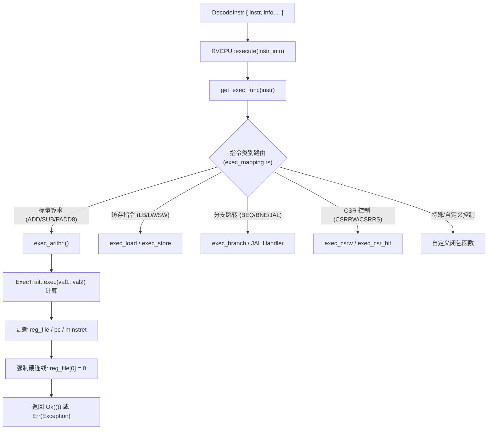

## 本章概览

在 Chapter 0x02 中，我们完成了模拟器前端从指令编码规则、JSON 元数据、`build.rs` 代码生成到 `Decoder` 译码与操作数提取（`RVInstrInfo`）的完整链路，并通过日志打印（`log::info!`）验证了自定义指令的成功匹配与触发。

然而，处理器不仅要“认出”指令，更重要的是“执行”指令。指令在译码完成后，必须送入后端的各个功能单元（算术逻辑单元 ALU、浮点单元 FPU、向量引擎 Vector、访存单元 Load/Store 以及 CSR 控制器）进行真正的算术计算、逻辑判断与 CPU 体系结构状态的变更（修改通用寄存器、更新 PC、写入内存或改变特权级状态）。

通过本章学习与实验，你将完成以下内容：
1. 深入理解模拟器的**后端执行引擎与指令分发架构**：`RVCPU::execute()`、执行分发表 `get_exec_func()`、执行包装器 `normal_exec` 以及指令退休计数（`Minstret`）推进机制。
2. 掌握模拟器优雅的**模块化计算抽象**：`ExecTrait` 与 `ExecUnaryTrait`，理解纯算术逻辑与 CPU 硬件状态机变更（寄存器读写、`x0` 恒零硬连线、异常传播）的解耦设计。
3. 掌握不同类型计算单元的设计理念与实现模式：标量 ALU 算术、Packed-SIMD 向量通道计算（进位隔离、溢出环绕与饱和截断）、位操作与访存执行核心。
4. **实践 1**：为 Chapter 0x02 中定义的自定义扩展指令（以 Packed-SIMD `padd8` 为例）实现完整的后端计算逻辑（`ExecTrait`）并在 `exec_mapping.rs` 中接入执行分发。
5. **实践 2**：使用 `TestCPUBuilder`、`CPUChecker` 与 `run_test_exec_decode` 编写覆盖边界值（全 0、全 1、通道溢出截断、`x0` 目标寄存器硬件约束）的严密 Rust 单元测试。
6. **实践 3**：在裸机 C 语言程序中编写测试套件与 Software Golden Model 软件参考模型，对比验证硬件模拟指令的计算正确性。
7. **综合实验任务**：为你在 Chapter 0x02 中构思并完成前端译码的自定义指令集，设计并实现完整的**后端执行单元**，通过全部 Rust 单元测试并在裸机环境下验证其功能。

---

## 一. 模拟器后端执行架构

模拟器的后端执行系统遵循“**分发路由 -> 计算求值 -> 状态写回 -> 流水推进/异常处理**”的标准处理器执行生命周期。

### 1. 指令分发与执行主回路

在 [src/isa/riscv/executor.rs]($env.repo/tree/master/src/isa/riscv/executor.rs) 中，`RVCPU::step_impl()` 在完成前端取指与译码后，调用 `self.execute(instr, info)`：



`execute()` 函数的内部实现非常精炼且极具鲁棒性：

```rust
pub(in super::super) fn execute(
    &mut self,
    instr: RiscvInstr,
    info: RVInstrInfo,
) -> Result<(), Exception> {
    // 1. 从静态函数映射表中检索当前指令对应的执行函数指针并调用
    let rst = get_exec_func(instr)(info, self);
    
    // 2. 硬件硬连线约束：无论指令是否尝试写入 x0 寄存器，始终强制清零
    self.reg_file[0] = 0;

    // 3. 异常检查与 cold_path 处理
    if let Err(ex) = rst {
        cold_path();
        if ex == Exception::IllegalInstruction {
            log::warn!(
                "IllegalInstruction for instr: {:#?} at pc = {:#x}, info: {:?} ",
                instr,
                self.pc,
                info,
            );
        }
    }

    rst
}
```

### 2. 执行包装器与流水线推进 (`normal_exec`)

在 RISC-V 体系结构中，一条普通的非跳转指令在执行成功后，必须完成两项标准动作：
1. **程序计数器推进**：`pc = pc + 4`（对于 32 位指令）或 `pc = pc + 2`（对于 16 位压缩指令）。
2. **指令退休计数器递增**：将 `minstret`（Machine Instructions-Retired Counter）CSR 增加 1。

为了避免在几百条指令的实现中重复编写上述容易遗漏的逻辑，模拟器在 [src/isa/riscv/instruction/mod.rs]($env.repo/tree/master/src/isa/riscv/instruction/mod.rs) 中提供了统一的高阶包装器 `normal_exec`：

```rust
#[inline(always)]
pub(super) fn normal_exec<F>(cpu: &mut RVCPU, f: F) -> Result<(), riscv::trap::Exception>
where
    F: FnOnce(&mut RVCPU) -> Result<(), riscv::trap::Exception>,
{
    // 1. 执行具体的指令逻辑（闭包 f）
    f(cpu)?;
    
    // 2. 成功后推进 PC 4 字节
    cpu.pc = cpu.pc.wrapping_add(4);
    
    // 3. 递增已退休指令计数 CSR
    cpu.csr.get_by_type_existing::<Minstret>().wrapping_add(1);
    
    Ok(())
}
```

> [!NOTE]
> **设计考量**：如果闭包 `f(cpu)` 在计算或访存过程中返回了 `Err(Exception)`（例如触发了非对齐访存或除零/非法指令），Rust 的 `?` 操作符会立即中断并返回异常，**不会**推进 `pc` 和 `minstret`。这样硬件的异常处理单元（`TrapController`）就可以准确捕获触发异常时的精确 PC（`mepc`）。

---

## 二. 核心计算抽象：`ExecTrait` 与模块化解耦

模拟器后端采用了函数式与泛型 Trait 相结合的架构，将**纯数学计算**与 **CPU 体系结构状态变更**进行了极致解耦。

### 1. `ExecTrait` 抽象定义

在 [src/isa/riscv/instruction/exec_function.rs]($env.repo/tree/master/src/isa/riscv/instruction/exec_function.rs) 中：

```rust
/// ExecTrait 定义了纯粹的二元操作数计算逻辑
pub(in super::super) trait ExecTrait<OUT, IN = WordType> {
    fn exec(a: IN, b: IN) -> OUT;
}

/// ExecUnaryTrait 定义了纯粹的一元操作数计算逻辑
pub(in super::super) trait ExecUnaryTrait<OUT, IN = WordType> {
    fn exec(a: IN) -> OUT;
}
```

### 2. 算术通用分发器 `exec_arith`

`exec_arith` 负责将提取出的指令操作数（来自寄存器堆或经过符号扩展的立即数）送入具体的 `ExecTrait`，并将结果写回目标寄存器 `rd`：

```rust
#[inline]
pub(super) fn exec_arith<F>(info: RVInstrInfo, cpu: &mut RVCPU) -> Result<(), Exception>
where
    F: ExecTrait<Result<WordType, Exception>>,
{
    super::normal_exec(cpu, |cpu| {
        let (rd, rst) = match info {
            // R 型指令：从寄存器堆读取 rs1 和 rs2 的值
            RVInstrInfo::R { rs1, rs2, rd } => {
                let (val1, val2) = cpu.reg_file.read(rs1, rs2);
                (rd, F::exec(val1, val2)?)
            }
            // I 型指令：从寄存器堆读取 rs1，操作数 2 直接使用译码器符号扩展后的 imm
            RVInstrInfo::I { rs1, rd, imm } => {
                let val1 = cpu.reg_file.read(rs1, 0).0;
                (rd, F::exec(val1, imm)?)
            }
            _ => unsafe { unreachable_unchecked() },
        };

        // 将计算结果写入目标寄存器 rd
        cpu.reg_file.write(rd, rst);
        Ok(())
    })
}
```

以标准加法 `ADD` / `ADDI` 为例，其算术核心实现极其简洁直观：

```rust
pub(in super::super) struct ExecAdd<T = WordType> {
    phantom: PhantomData<T>,
}

impl<T> ExecTrait<Result<T, Exception>, T> for ExecAdd<T>
where
    T: UnsignedInteger,
{
    fn exec(a: T, b: T) -> Result<T, Exception> {
        Ok(a.wrapping_add(&b))
    }
}
```

在 `exec_mapping.rs` 中，只需一行即可完成多条指令的高效绑定：
```rust
RiscvInstr::ADD | RiscvInstr::ADDI => exec_arith::<ExecAdd>,
```

---

## 三. 计算单元设计模式与算术语义实现

在为 CPU 设计各种扩展计算单元时，常见的模式包括标量 ALU、Packed-SIMD 向量打包计算、单目位操作以及特殊副作用单元。

### 1. Packed-SIMD 计算单元与进位隔离 (Carry Isolation)

在 Chapter 0x02 中，我们构思了属于 `custom-0` 空间的 8-bit 打包加法指令 `padd8`。

#### 硬件原理与进位隔离

在 Packed-SIMD 中，一个 32 位（或 64 位）寄存器被均等划分为多个独立的 8 位通道（Sub-words / Lanes）：

```text
寄存器 rs1:  [  Byte 3  ] [  Byte 2  ] [  Byte 1  ] [  Byte 0  ]
                 +             +             +             +
寄存器 rs2:  [  Byte 3' ] [  Byte 2' ] [  Byte 1' ] [  Byte 0' ]
                 │             │             │             │
                [X] 进位阻断  [X] 进位阻断  [X] 进位阻断    ▼ (溢出截断)
                 ▼             ▼             ▼             ▼
寄存器 rd :  [ Byte 3" ] [ Byte 2" ] [ Byte 1" ] [ Byte 0" ]
```

> [!WARNING]
> **关键陷阱：为什么不能直接用 `a + b`？**
> 如果直接将 32 位寄存器做常规加法，当 `Byte 0` 发生溢出（如 `0xFF + 0x01 = 0x100`）时，溢出的进位（Carry bit）会悄悄溢入高位的 `Byte 1`，从而彻底破坏相邻通道数据的独立性！
> 在硬件 SIMD 算术逻辑单元中，各个通道之间的进位链必须被物理切断（Carry Isolation），每个通道独立按 `u8::wrapping_add` 进行 8 位环绕运算。

#### Rust 实现方式

我们可以通过字节切片转换（`to_le_bytes()`）或位移掩码（SWAR 技巧）来实现干净的通道级并行运算：

```rust
pub(in super::super) struct ExecPadd8;

impl ExecTrait<Result<WordType, Exception>> for ExecPadd8 {
    fn exec(a: WordType, b: WordType) -> Result<WordType, Exception> {
        let a_bytes = a.to_le_bytes();
        let b_bytes = b.to_le_bytes();
        let mut res = [0u8; std::mem::size_of::<WordType>()];

        // 各通道独立执行 8-bit 环绕加法，进位互不干扰
        for i in 0..std::mem::size_of::<WordType>() {
            res[i] = a_bytes[i].wrapping_add(b_bytes[i]);
        }

        Ok(WordType::from_le_bytes(res))
    }
}
```

### 2. 饱和算术 (Saturating Arithmetic)

在音视频处理和图像渲染中，数据溢出若发生环绕（Wrap-around，如白色像素 255 + 1 变成黑色 0）会造成严重的画面闪烁。饱和加法（Saturating Add）要求当结果超过最大值时，自动钳位（Clamp）在最大值：

```rust
pub(in super::super) struct ExecPadd8Sat;

impl ExecTrait<Result<WordType, Exception>> for ExecPadd8Sat {
    fn exec(a: WordType, b: WordType) -> Result<WordType, Exception> {
        let a_bytes = a.to_le_bytes();
        let b_bytes = b.to_le_bytes();
        let mut res = [0u8; std::mem::size_of::<WordType>()];

        for i in 0..std::mem::size_of::<WordType>() {
            // 8 位无符号饱和加法：超过 255 则锁定为 255
            res[i] = a_bytes[i].saturating_add(b_bytes[i]);
        }

        Ok(WordType::from_le_bytes(res))
    }
}
```

### 3. 单目与位操作计算单元 (Bit Manipulation Unit)

对于一元操作数指令（如按位反转 `brev`、统计置 1 的位数 `cpop`、前导零计数 `clz`），可使用 `ExecUnaryTrait`：

```rust
pub(in super::super) struct ExecCpop;

impl ExecUnaryTrait<Result<WordType, Exception>> for ExecCpop {
    fn exec(a: WordType) -> Result<WordType, Exception> {
        Ok(a.count_ones() as WordType)
    }
}
```

---

## 实践 1：实现自定义指令后端执行逻辑与分发

在 Chapter 0x02 中，我们在 `data/instr_dict_custom.json` 中定义了 `padd8`，并在 `exec_mapping.rs` 中只做了 `log::info!` 临时响应。现在我们来为它赋予真正的后端计算能力。

### 1. 编写计算结构体与 Trait 实现

在 [src/isa/riscv/instruction/exec_function.rs]($env.repo/tree/master/src/isa/riscv/instruction/exec_function.rs) 的末尾添加：

```rust
#[cfg(feature = "custom-instr")]
pub(in super::super) struct ExecPadd8;

#[cfg(feature = "custom-instr")]
impl ExecTrait<Result<WordType, Exception>> for ExecPadd8 {
    fn exec(a: WordType, b: WordType) -> Result<WordType, Exception> {
        let a_bytes = a.to_le_bytes();
        let b_bytes = b.to_le_bytes();
        let mut res = [0u8; std::mem::size_of::<WordType>()];

        for i in 0..std::mem::size_of::<WordType>() {
            res[i] = a_bytes[i].wrapping_add(b_bytes[i]);
        }

        Ok(WordType::from_le_bytes(res))
    }
}
```

### 2. 在 `exec_mapping.rs` 中配置分发路由

打开 [src/isa/riscv/instruction/exec_mapping.rs]($env.repo/tree/master/src/isa/riscv/instruction/exec_mapping.rs)，找到 `RV_Custom` 部分，将原有的 `todo!()` 替换为 `exec_arith::<ExecPadd8>`：

```rust
        //---------------------------------------
        // RV_Custom
        //---------------------------------------
        #[cfg(feature = "custom-instr")]
        RiscvInstr::PADD8 => exec_arith::<ExecPadd8>,
```

编译检查：
```bash
cargo check --features custom-instr
```

---

## 实践 2：编写严密的 CPU 执行单元测试

单元测试是确保模拟器指令执行正确性的首要防线。

### 1. 构建全方位的测试向量

在 [src/isa/riscv/cpu_test.rs]($env.repo/tree/master/src/isa/riscv/cpu_test.rs) 中，我们利用 `TestCPUBuilder` 和 `CPUChecker` 编写针对后端执行语义的细致测试：

```rust
#[test]
#[cfg(feature = "custom-instr")]
fn test_custom_padd8_backend_execution() {
    // 构造指令: padd8 x3, x1, x2 -> 0x0020818B
    let raw_padd8: u32 = 0x0020818B;

    // 用例 1：多通道基础无进位加法
    run_test_exec_decode(
        raw_padd8,
        |builder| {
            builder
                .reg(1, 0x01020304)
                .reg(2, 0x05060708)
                .pc(0x80000000)
        },
        |checker| {
            checker
                .reg(3, 0x06080A0C)
                .pc(0x80000004) // 验证 PC 正确推进
        },
    );

    // 用例 2：进位隔离与单通道独立溢出截断 (Carry Isolation Test)
    // byte0: 0x02 + 0xFE = 0x100 -> 0x00 (不能产生进位影响 byte1)
    // byte1: 0xFE + 0x02 = 0x100 -> 0x00
    // byte2: 0x01 + 0xFF = 0x100 -> 0x00
    // byte3: 0xFF + 0x01 = 0x100 -> 0x00
    run_test_exec_decode(
        raw_padd8,
        |builder| {
            builder
                .reg(1, 0xFF01FE02)
                .reg(2, 0x01FF02FE)
                .pc(0x80000000)
        },
        |checker| {
            checker
                .reg(3, 0x00000000)
                .pc(0x80000004)
        },
    );

    // 用例 3：硬件约束验证——写入 x0 寄存器必须被丢弃
    // 构造指令: padd8 x0, x1, x2 -> 0x0020800B
    let raw_padd8_to_x0: u32 = 0x0020800B;
    run_test_exec_decode(
        raw_padd8_to_x0,
        |builder| {
            builder
                .reg(1, 0x11223344)
                .reg(2, 0x55667788)
        },
        |checker| {
            checker.reg(0, 0) // x0 必须保持恒为 0
        },
    );
}
```

### 2. 连续步进流水线测试 (`run_test_cpu_step`)

除了单指令测试，还需要测试指令与标准指令交替执行时的寄存器依赖传递：

```rust
#[test]
#[cfg(feature = "custom-instr")]
fn test_custom_padd8_pipeline_step() {
    let program = [
        0x00500093, // addi x1, x0, 5    (x1 = 5)
        0x00a00113, // addi x2, x0, 10   (x2 = 10)
        0x0020818B, // padd8 x3, x1, x2  (x3 = 15)
        0x0031820B, // padd8 x4, x3, x3  (x4 = 30)
    ];

    run_test_cpu_step(
        &program,
        |builder| builder.pc(ram_config::BASE_ADDR),
        |checker| {
            checker
                .reg(1, 5)
                .reg(2, 10)
                .reg(3, 15)
                .reg(4, 30)
                .pc(ram_config::BASE_ADDR + 16)
        },
    );
}
```

运行单元测试：
```bash
cargo test --features custom-instr test_custom_padd8
```

---

## 实践 3：C 语言裸机端与 Golden Model 自动化比对

在裸机 C 程序中，最佳实践是编写纯软件的参考模型（Golden Model），通过大规模测试向量自动对比硬件指令与软件模型的结果。

### 1. 编写 Golden Model 与测试用例

在 `test_resources/src/main.c` 中：

```c
#include "io.h"
#include "custom_ops.h"
#include <stdint.h>

// 纯软件 C 语言参考模型 (Golden Model)
static uint32_t golden_padd8(uint32_t a, uint32_t b) {
    uint8_t a0 = a & 0xFF, a1 = (a >> 8) & 0xFF, a2 = (a >> 16) & 0xFF, a3 = (a >> 24) & 0xFF;
    uint8_t b0 = b & 0xFF, b1 = (b >> 8) & 0xFF, b2 = (b >> 16) & 0xFF, b3 = (b >> 24) & 0xFF;
    
    uint8_t r0 = (uint8_t)(a0 + b0);
    uint8_t r1 = (uint8_t)(a1 + b1);
    uint8_t r2 = (uint8_t)(a2 + b2);
    uint8_t r3 = (uint8_t)(a3 + b3);
    
    return ((uint32_t)r0) |
           (((uint32_t)r1) << 8) |
           (((uint32_t)r2) << 16) |
           (((uint32_t)r3) << 24);
}

// 测试数据集
typedef struct {
    uint32_t a;
    uint32_t b;
} TestCase;

static const TestCase test_cases[] = {
    {0x01020304, 0x05060708},
    {0xFF01FE02, 0x01FF02FE},
    {0x80808080, 0x80808080},
    {0x00000000, 0x00000000},
    {0xFFFFFFFF, 0xFFFFFFFF},
    {0x12345678, 0x87654321},
};

int main() {
    printf("=== Starting Custom Instruction Backend Verification ===
");

    int total = sizeof(test_cases) / sizeof(test_cases[0]);
    int passed = 0;

    for (int i = 0; i < total; i++) {
        uint32_t a = test_cases[i].a;
        uint32_t b = test_cases[i].b;

        // 调用通过 .insn 内嵌汇编封装的硬件指令
        uint32_t hw_result = padd8(a, b);
        
        // 调用软件 Golden Model
        uint32_t sw_result = golden_padd8(a, b);

        if (hw_result == sw_result) {
            printf("[PASS] Test %d: a=0x%x, b=0x%x -> res=0x%x
", i, a, b, hw_result);
            passed++;
        } else {
            printf("[FAIL] Test %d: a=0x%x, b=0x%x -> HW=0x%x, SW=0x%x
", i, a, b, hw_result, sw_result);
        }
    }

    if (passed == total) {
        printf("=== ALL %d TESTS PASSED SUCCESSFULLY! ===
", total);
    } else {
        printf("=== VERIFICATION FAILED! (%d/%d passed) ===
", passed, total);
    }

    return 0;
}
```

### 2. 编译与全系统执行验证

```bash
# 1. 编译裸机测试程序
make -C test_resources

# 2. 启动模拟器并执行验证
cargo run --features custom-instr -- ./test_resources/bin/main.elf
```

---

## 项目导览

- **CPU 执行分发总控**：[src/isa/riscv/executor.rs]($env.repo/tree/master/src/isa/riscv/executor.rs)（`execute()`, `step_impl()`）
- **指令执行映射表**：[src/isa/riscv/instruction/exec_mapping.rs]($env.repo/tree/master/src/isa/riscv/instruction/exec_mapping.rs)（`get_exec_func()`）
- **算术/逻辑执行函数与 Trait 定义**：[src/isa/riscv/instruction/exec_function.rs]($env.repo/tree/master/src/isa/riscv/instruction/exec_function.rs)（`ExecTrait`, `ExecUnaryTrait`, `exec_arith`）
- **流水推进与执行包装**：[src/isa/riscv/instruction/mod.rs]($env.repo/tree/master/src/isa/riscv/instruction/mod.rs)（`normal_exec`, `check_jump_alignment`）
- **核心访存与状态更新**：[src/isa/riscv/instruction/exec_core.rs]($env.repo/tree/master/src/isa/riscv/instruction/exec_core.rs)
- **单元测试套件与 Checker**：[src/isa/riscv/cpu_tester.rs]($env.repo/tree/master/src/isa/riscv/cpu_tester.rs) 与 [src/isa/riscv/cpu_test.rs]($env.repo/tree/master/src/isa/riscv/cpu_test.rs)
- **裸机 C 测试资源**：[test_resources/]($env.repo/tree/master/test_resources/)

---

## 综合实验任务：为 Chapter 0x02 自定义指令实现完整后端执行单元

在 Chapter 0x02 中，你已经构思并完成了指令的格式定义、JSON 描述注入、前端译码与 C 语言内嵌汇编 API 封装。现在，请为你构思的一组自定义指令完成真正的**后端执行单元**：

1. **确定并实现计算语义**：
   - 在 `src/isa/riscv/instruction/exec_function.rs`（或新建的模块）中编写具体的计算逻辑。
   - 优先采用实现 `ExecTrait` 或 `ExecUnaryTrait` 的方式，确保纯算术计算与硬件状态解耦。
   - 正确处理进位隔离、数据截断、符号位扩展或饱和截断。
2. **接入模拟器执行路由**：
   - 在 `src/isa/riscv/instruction/exec_mapping.rs` 中为你的指令绑定对应的执行函数，替换原先的 `log::info!` 或占位代码。
3. **编写 Rust 执行单元测试**：
   - 在 `src/isa/riscv/cpu_test.rs` 中使用 `TestCPUBuilder` 和 `CPUChecker` 编写针对后端执行结果的测试函数。
   - 必须覆盖多种输入场景：常规输入、极端边界值（全 0、全 1、溢出点）、通道独立性测试以及 `rd=x0` 的硬连线测试。
   - 运行 `cargo test --features custom-instr` 确保测试全部通过。
4. **C 语言裸机综合测试与验证**：
   - 在 `test_resources` 下编写或扩展裸机 C 测试程序，调用你封装的 C API。
   - 构造丰富的测试数据集，使用 C 语言软件参考模型（Golden Model）进行自动化比对。
   - 使用 `cargo run --features custom-instr -- ./test_resources/bin/main.elf` 运行，并在终端观察到所有测试 PASS 输出。
