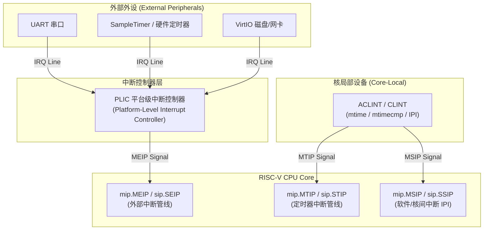
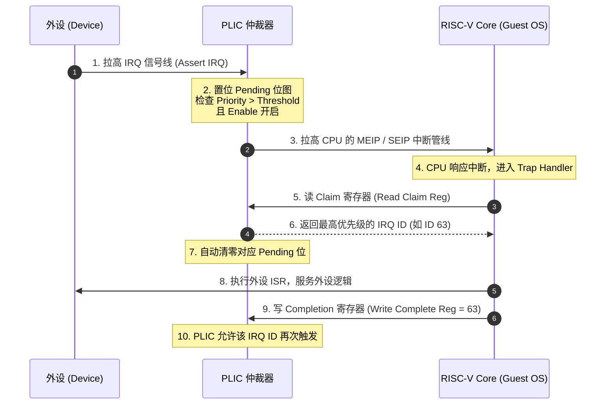
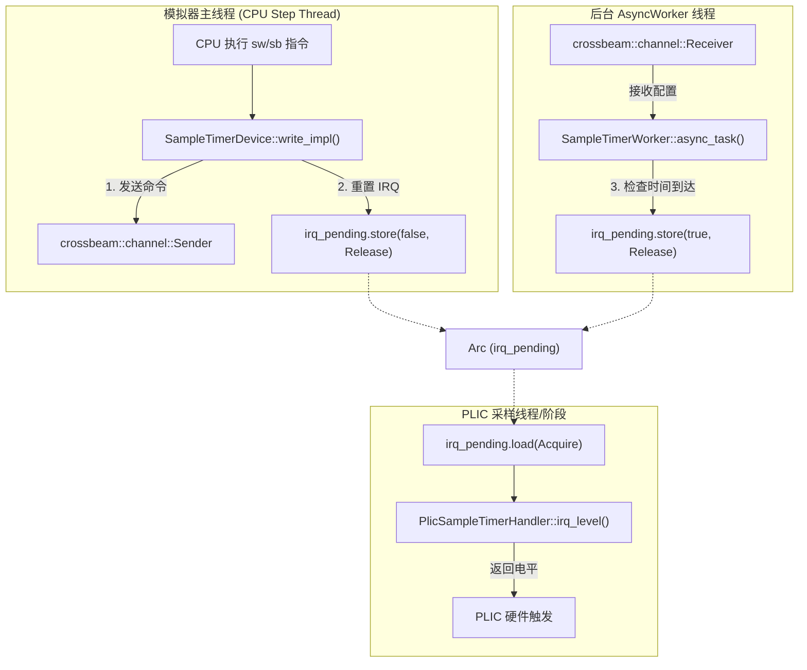
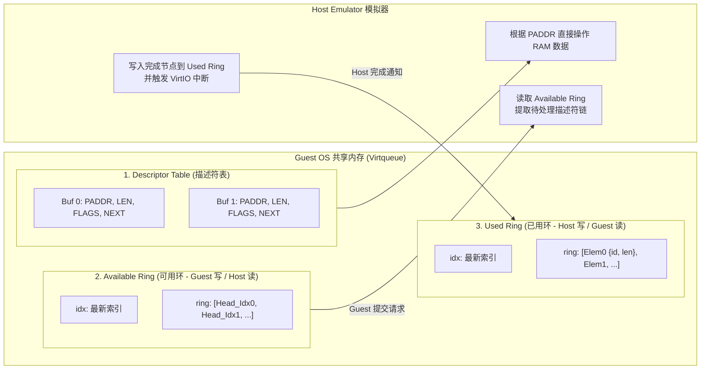
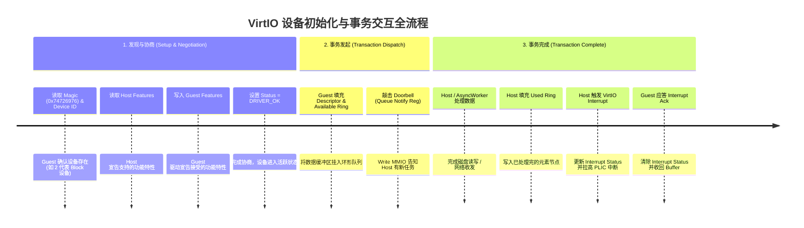

[REPO]: https://github.com/WanDejun/riscv-emulator

## 本章概览

在现代计算机系统架构中，CPU 绝非孤立运转的算术引擎，它需要时刻与丰富的外围设备（Peripherals）交互：通过串口（UART）输出调试日志、通过定时器（Timer）触发任务调度、通过网卡与磁盘进行高速 I/O。

模拟器不仅要模拟 CPU 指令的执行，还需要构建一套高效、规范且支持并发的外设与中断抽象层。本章将带你深入 RISC-V 的中断体系拓扑（PLIC & ACLINT/CLINT），剖析模拟器的外设 Trait 基础设施与异步任务框架（`AsyncWorker`），解析基于 VirtIO 规范的半虚拟化（Paravirtualization）机制，并最终引导你开发一个具有实际功能的系统级外设。

通过本章学习与实验，你将完成以下内容：
1. 理解 RISC-V 外部中断（PLIC）与局部中断（ACLINT/CLINT）的硬件拓扑及工作机制。
2. 掌握模拟器外设架构：`DeviceTrait`、`MemMappedDeviceTrait`、`PlicIRQSource` 以及结合原子变量与内存屏障的 `AsyncWorker` 异步解耦框架。
3. 理解 VirtIO 规范：Virtqueue 共享环（Available/Used Ring）、Feature 协商机制、Doorbell 门铃机制以及半虚拟化 vs 全虚拟化的陷入陷出（Trap & Emulate）原理。
4. **综合实验任务**：独立开发一个可直接被 Linux Kernel 内核驱动识别与使用的真实外设（如 VirtIO-Net、VirtIO-FS、GPIO、Watchdog 等）。

---

## 一、 RISC-V 中断体系与 PLIC 工作机制

### 1. 中断拓扑与体系结构

在 RISC-V 系统架构中，中断按来源与作用域划分为两大核心子系统：



1. **核局部中断控制器（ACLINT / CLINT）**：
   - 负责生成处理器核本地的**定时器中断（Timer Interrupt, `MTIP`）**和**核间软件中断（Software Interrupt / IPI, `MSIP`）**。
   - 硬件寄存器 `mtime`（全局高精度计数器）和 `mtimecmp`（比较寄存器）直接映射在 MMIO 空间中。当 `mtime >= mtimecmp` 时，硬件自动拉高当前 Core 的 `MTIP` 管线。
2. **平台级中断控制器（PLIC）**：
   - 负责收集与仲裁系统中成百上千个外部设备（如 UART、网卡、VirtIO 设备）发出的**外部中断（External Interrupt, `MEIP`/`SEIP`）**。
   - PLIC 负责完成优先权仲裁，并将最高优先级的中断信号汇总输出给 CPU Core。

想深入探讨 RISC-V 体系结构基础，可参考：[问 AI：什么是 RISC-V，为什么要学习 RISC-V？](https://kimi.moonshot.cn/_prefill_chat?prefill_prompt=什么是riscv,为什么要学riscv&send_immediately=true&force_search=true)

---

### 2. PLIC 的核心工作机制

PLIC（Platform-Level Interrupt Controller）作为一个独立的硬件仲裁单元，内部维护了以下关键寄存器与状态状态机：

- **Priority（中断优先级寄存器）**：为每个外部中断源（IRQ ID）配置优先级（通常 0 表示禁用该中断，数值越大优先级越高）。
- **Pending（中断挂起位图）**：设备拉高 IRQ 线后，PLIC 将对应的 Pending 位置 1，表示该中断正在等待处理。
- **Enable（中断使能位图）**：按 CPU Hart 与特权级（M-mode / S-mode）控制是否允许响应特定 IRQ ID。
- **Threshold（中断优先级阈值）**：只有优先级**严格大于** Threshold 的 Pending 中断才会被允许递交给 CPU。
- **Claim / Complete（中断响应与完成寄存器）**：CPU 读写该寄存器以完成与 PLIC 的握手交互。

PLIC 的中断服务完整生命周期如下图所示：



欲了解更多 PLIC 的寄存器偏移与硬件规范细节，可查阅：[问 AI：深入理解 RISC-V PLIC 中断控制器规范](https://kimi.moonshot.cn/_prefill_chat?prefill_prompt=详细解释RISC-V的PLIC中断控制器规范,包括Priority,Pending,Enable,Threshold,Claim和Complete机制&send_immediately=true&force_search=true)

---

## 二、 模拟器外设架构与 SamplerTimer 代码导读

在模拟器中，为了让外设既能优雅地挂载到地址总线（MMIO），又不会因为耗时 I/O 阻塞 CPU 指令推进主线程，模拟器设计了一套高度解耦的**设备 Trait 基础设施**与**异步任务 Worker 框架**。

### 1. 基础基础设施与 Trait 体系

在 [src/device/mod.rs](REPO/tree/master/src/device/mod.rs) 中，模拟器定义了核心的外设接口抽象：

1. **`DeviceTrait`（通用外设接口）**：
   ```rust
   pub trait DeviceTrait {
       fn read(&mut self, addr: WordType, len: u32) -> Result<u64, MemError>;
       fn write(&mut self, addr: WordType, len: u32, data: u64) -> Result<(), MemError>;
       fn sync(&mut self);
       /// 返回需要注册到后台线程执行的异步 Worker
       fn get_async_worker(&mut self) -> Option<Box<dyn AsyncWorker>>;
   }
   ```
2. **`MemMappedDeviceTrait`（内存映射外设接口）**：
   扩展自 `DeviceTrait`，提供静态方法 `base()` 和 `size()`，用于模拟器启动时在 `MemoryMapIO` 中快速注册地址区间。
3. **`PlicIRQSource` & `PlicDeviceHandler`（中断管线接入）**：
   外设通过实现 `PlicDeviceHandler` 的 `irq_level(&self) -> bool` 方法提供当前中断电平状态。PLIC 采样定时器或电平探测器会轮询该接口获取最新电平。

---

### 2. SamplerTimer 异步架构源码解析

[src/device/sample_timer.rs](REPO/tree/master/src/device/sample_timer.rs) 是模拟器提供的一个完整的毫秒级测试定时器外设。它清晰地演示了**主线程 MMIO 响应**与**后台 `AsyncWorker` 异步计时**的协作关系：



#### 核心源码解析

1. **命令解耦（Channel & AsyncWorker）**：
   当 CPU 通过 MMIO 写入 `SampleTimerDevice` 的时间配置寄存器时，主线程只做轻量级数据更新，并通过 `crossbeam::channel` 异步发送 `WorkerCommand::Data` 给 `SampleTimerWorker`：
   ```rust
   // sample_timer.rs
   0x08 => {
       self.layout.data_register0 = data_u32;
       self.sender.try_send(WorkerCommand::Data {
           interval_ms: self.get_data64(),
           configured_at: Instant::now(),
       }).unwrap();
   }
   ```
2. **异步后台轮询（`AsyncWorker::async_task`）**：
   `SampleTimerWorker` 在独立的线程循环中执行 `async_task()`，检查时间差。当到达定时时间后，将原子变量 `irq_pending` 置为 `true`：
   ```rust
   if !self.irq_pending.load(Ordering::Acquire)
       && cur.duration_since(self.pre_time) >= self.step_time
   {
       self.irq_pending.store(true, Ordering::Release);
       made_progress = true;
   }
   ```

---

### 3. 内存屏障与 Guest OS 内存可见性（Memory Barrier & Visibility）

在编写具有 DMA（Direct Memory Access）能力或带异步 Backend 的外设（例如磁盘读取、网卡接收包、`AsyncWorker` 直接写入模拟器物理 RAM 缓冲区）时，存在一个**极其关键的技术隐患**：

> **内存乱序与可见性陷阱**：
> 后台 `AsyncWorker` 线程将从磁盘/网络读取到的数据写入物理内存（RAM ArrayBuffer）后，如果**没有施加正确的内存屏障**就直接拉高 PLIC 中断，主线程的 CPU Core（Guest OS）可能会在接收到中断并试图读取数据时，由于 CPU/编译器/宿主机的指令重排与 Cache 暂存，**读取到写之前的旧数据/脏数据（Stale Read）**。

#### 解决方案：使用 `Ordering::Release` 与 `Ordering::Acquire` 屏障

在 Rust 中，通过 `std::sync::atomic` 的内存顺序保证可见性：
- **发送端（`AsyncWorker` 写入 RAM 后）**：在拉高中断状态 `irq_pending.store(true, Ordering::Release)` 时使用 **`Release` 语义**。它确保在此之前所有的内存写入（包括对物理 RAM 缓冲区的 DMA 填充）均已完成刷新，且对其他线程可见。
- **接收端（PLIC / CPU 读取中断前）**：使用 `irq_pending.load(Ordering::Acquire)` **`Acquire` 语义**。它与 Release 形成同步屏障（Synchronizes-with Relationship），保证 Guest OS 看到中断成立时，一定能看到 Release 之前写入物理内存的完整最新数据！

---

## 三、 VirtIO 规范与半虚拟化机制

在真实物理世界中，模拟一套复杂的网卡或显卡硬件（如 Intel e1000 或 NVMe 规范）需要模拟成百上千个复杂的硬件控制寄存器，产生极高的陷入/陷出开销。为此，现代虚拟化技术广泛采用了 **VirtIO 半虚拟化（Paravirtualization）标准**。

想了解 VirtIO 规范的演进与底层细节，可参考：[问 AI：深入理解 VirtIO 规范与半虚拟化机制](https://kimi.moonshot.cn/_prefill_chat?prefill_prompt=深入解释VirtIO规范,Split%20Virtqueue结构,Available%20Ring,Used%20Ring,Doorbell门铃机制与半虚拟化工作原理&send_immediately=true&force_search=true)

### 1. 半虚拟化 (Paravirtualization) vs 全虚拟化 (Full Virtualization)

- **全虚拟化 (Full Virtualization / Trap & Emulate)**：
  Guest OS 无需修改，使用原生的物理设备驱动。Guest 每读写一次外设寄存器，都会触发一次硬件内存异常，导致 CPU **陷入（Trap-out）** 到模拟器/Hypervisor，模拟器修改完状态后再 **陷回（Trap-in）** Guest。由于陷入陷出涉及昂贵的上下文切换，性能极差。
- **半虚拟化 (Paravirtualization / VirtIO)**：
  Guest OS 明知自己运行在虚拟机中，装载专用的 VirtIO 驱动。Guest 与 Host 约定一块**共享物理内存（Virtqueue 环形缓冲区）**。Guest 批量准备好成百上千个数据包后，只需触发一次 **门铃（Doorbell）** 寄存器通知 Host，极大减少了陷入陷出次数，接近原生物理硬件性能！

---

### 2. VirtIO 核心机制：Virtqueue 与 Ring 结构

VirtIO 的核心数据传输结构称为 **Virtqueue**（包含 Split Virtqueue 和 Packed Virtqueue 两种格式）。Split Virtqueue 由三部分共享内存数组组成：



1. **Descriptor Table（描述符表）**：记录每一块数据缓冲区的物理地址 `paddr`、长度 `len`、读写标志 `flags` 以及链式下一项指针 `next`。
2. **Available Ring（可用环）**：由 **Guest 写入，Host 读取**。Guest 将填好数据的描述符链头索引写入 Available Ring，通知 Host“有新请求待处理”。
3. **Used Ring（已用环）**：由 **Host 写入，Guest 读取**。Host 完成 I/O 操作（如从磁盘读出数据填充到描述符缓冲区）后，将描述符索引与写入长度填入 Used Ring，通知 Guest“请求已完成”。

---

### 3. Feature 协商与事务全生命周期

VirtIO 设备的初始化与事务处理遵循严格的状态机协商机制：



---

## 四、 综合实验任务：开发一个实际功能的系统外设

在本实验中，你将独立设计并实现一个**具备实际应用价值的系统级外设**，并将其挂载到模拟器的 MMIO 地址空间，使其能够被 Linux 操作系统内核直接识别并正常工作！

### 1. 推荐选题方向（均支持 Linux 内核驱动识别）

你可以根据个人兴趣从以下项目中选择一个进行实现：

| 选题名称                  | 规范与类型                 | 核心挑战与特色                                                                                     | 验证方式                             |
| ------------------------- | -------------------------- | -------------------------------------------------------------------------------------------------- | ------------------------------------ |
| **VirtIO-Console**        | VirtIO (Device ID 3)       | 实现半虚拟化控制台，支持控制台输入输出                                                             | Linux 开机输出 `/dev/hvc0`           |
| **VirtIO-Net**            | VirtIO (Device ID 1)       | 结合 TAP/TUN 宿主网卡，实现网络收发包                                                              | Linux 内核中 `ping` 联通网络         |
| **VirtIO-FS / VirtIO-9P** | VirtIO (Device ID 26 / 9P) | 实现文件系统共享，将宿主目录挂载入虚拟机                                                           | Linux 中 `mount -t 9p` 读写宿主文件  |
| **VirtIO-RNG**            | VirtIO (Device ID 4)       | 硬件随机数生成器，响应熵池读取                                                                     | Linux 中 `cat /dev/hwrng` 获取随机数 |
| **GPIO 控制器**           | 自定义 MMIO 设备           | 实现数字输入输出管脚；可通过模拟器终端 `Ctrl+A` 命令模式输入 `1`/`0` 模拟引脚电平变化，并 log 输出 | 裸机/Linux 驱动中读写 GPIO 寄存器    |
| **I2C Adapter**           | 自定义 MMIO / I2C 总线     | 实现 I2C 总线控制器，并在总线上挂载虚拟 LED 点阵或传感器                                           | 读写 I2C 寄存器控制子设备            |
| **Watchdog Timer**        | 自定义 MMIO 定时器         | 实现看门狗倒计时，超时未“喂狗”触发系统复位或中断                                                   | 编写测试程序验证看门狗复位           |
| **RGB 颜色输出设备**      | 自定义 MMIO 显示设备       | 接收 RGB888 像素数据，并在终端中显示 ANSI 彩色块输出                                               | 在终端中打印彩色图像/图案            |

> **提示**：强烈推荐优先尝试 **VirtIO 系列设备** 或 **GPIO / Watchdog** 设备。VirtIO 设备可以无缝使用 Linux Kernel 内置的标准驱动，无需自己为 Linux 编写内核模块！

---

### 2. 实验要求与实现指导

1. **设备映射与注册**：
   在 [src/device/config.rs](REPO/tree/master/src/device/config.rs) 中配置新外设的 MMIO 基地址 `BASE` 与 `SIZE`，并实现 `MemMappedDeviceTrait`。
2. **使用 `AsyncWorker` 异步解耦**：
   外设中涉及耗时 I/O（如文件读写、网络收发、定时器等待）的操作，**必须**重写 `get_async_worker()` 方法，将耗时任务放入 `AsyncWorker` 线程中执行，严禁阻塞模拟器主 CPU 线程。
3. **保证内存屏障与可见性**：
   若外设直接向模拟器物理 RAM 写入数据（如 DMA 或 Virtqueue 写入），必须在触发 PLIC 中断前使用 `Ordering::Release` 原子屏障，确保内存数据对 Guest OS 完全可见。
4. **中断管线接入**：
   实现 `PlicIRQSource`，在 [src/board/virt.rs](REPO/tree/master/src/board/virt.rs) 或设备构建逻辑中将外设的 IRQ 线连接至 PLIC。

---

## 项目导览

- **外设 Trait 抽象定义**：[src/device/mod.rs](REPO/tree/master/src/device/mod.rs)（定义 `DeviceTrait`、`MemMappedDeviceTrait` 与 `PlicDeviceHandler`）
- **MMIO 总线与地址映射**：[src/device/mmio.rs](REPO/tree/master/src/device/mmio.rs)（`MemoryMapIO` 实现物理地址重定向与读写分发）
- **外设地址布局配置**：[src/device/config.rs](REPO/tree/master/src/device/config.rs)（定义基地址 `BASE` 与内存大小 `SIZE`）
- **异步 Task 框架**：[src/async_worker.rs](REPO/tree/master/src/async_worker.rs)（`AsyncWorker` 异步任务抽象）
- **ACLINT / CLINT 定时器**：[src/device/aclint.rs](REPO/tree/master/src/device/aclint.rs)（`mtime` / `mtimecmp` 与 `MTIP` / `MSIP` 局部中断）
- **PLIC 中断控制器**：[src/device/plic/mod.rs](REPO/tree/master/src/device/plic/mod.rs) 与 [src/device/plic/irq_line.rs](REPO/tree/master/src/device/plic/irq_line.rs)（外部中断仲裁、Claim / Complete 握手与 IRQ 采样管线）
- **SampleTimer 参考外设**：[src/device/sample_timer.rs](REPO/tree/master/src/device/sample_timer.rs)（带 `AsyncWorker`、通道解耦与原子内存屏障的完整毫秒定时器）
- **VirtIO MMIO 传输层**：[src/device/virtio/virtio_mmio.rs](REPO/tree/master/src/device/virtio/virtio_mmio.rs)（VirtIO 控制寄存器、Feature 协商与 Doorbell 响铃机制）
- **Virtqueue 队列机制**：[src/device/virtio/virtio_queue.rs](REPO/tree/master/src/device/virtio/virtio_queue.rs)（Descriptor Table、Available Ring 与 Used Ring 共享内存实现）
- **VirtIO Block 设备实现**：[src/device/virtio/virtio_blk.rs](REPO/tree/master/src/device/virtio/virtio_blk.rs)（半虚拟化块设备参考实现）
- **板卡总线与 IRQ 连接**：[src/board/virt.rs](REPO/tree/master/src/board/virt.rs)（板卡外设初始化与 PLIC 中断管线挂载）
