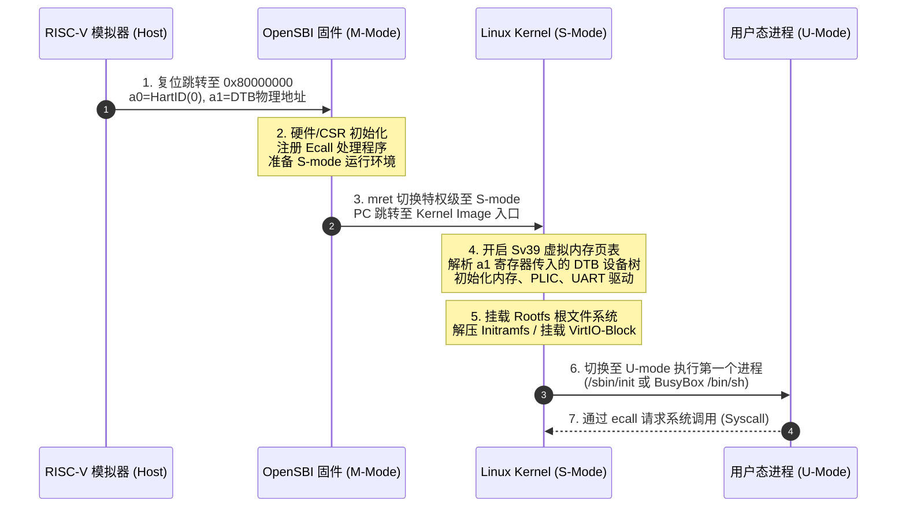
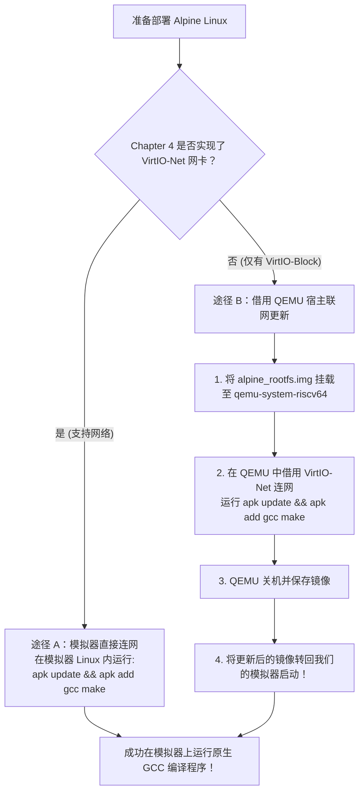

[REPO]: https://github.com/WanDejun/riscv-emulator

## 本章概览

经过前面章节的学习，我们从指令集译码执行、裸机汇编、中断特权级切换，一路推进到了外设与 VirtIO 机制。现在，我们将迎接模拟器项目最重要的终极里程碑——**引导运行 Linux 操作系统内核并部署完整 Linux 发行版（Alpine Linux）**。

在全系统模拟（Full System Emulation）下，Linux 内核的引导绝非简单地把二进制加载到内存执行，它涉及到**固件（OpenSBI）**、**设备树（Device Tree / DTS）**、**特权级交接（M-mode 到 S-mode）**、**内存映射（Sv39 页表）** 以及 **根文件系统（Rootfs / Initramfs）** 的全方位协调。

通过本章学习与实验，你将完成以下内容：
1. 深入理解 RISC-V Linux 系统的启动链条（OpenSBI -> Linux Kernel -> Initramfs / Rootfs）。
2. 掌握设备树（DTS / DTB）的语法规范、硬件描述节点以及 Kernel 解析发现物理外设的原理。
3. 理解 RISC-V SBI（Supervisor Binary Interface）规范与 M-mode / S-mode 的服务调用交互。
4. **验证性实验小任务一**：使用预编译 Linux 镜像启动模拟器，通过 `dd` 与 `mkfs.ext4` 制作 VirtIO-Block 磁盘镜像，并将自己的 RISC-V 用户态程序注入 Linux 运行。
5. **进阶实验小任务二**：将模拟器配置为以 VirtIO-Block 作为 Rootfs 挂载 Alpine Linux 根文件系统，使用包管理器（`apk`）在线/借用 QEMU 安装编译开发环境（如 GCC）。

---

## 一、 Linux 内核启动流程全貌

在全系统模拟下，Linux 内核的引导涉及固件、特权级交接、设备树解析以及根文件系统挂载。

### 1. 引导启动链路与特权级交接

想深入了解 RISC-V Linux 内核启动的底层细节，可参考：[问 AI：深入理解 RISC-V Linux 内核引导启动流程](https://kimi.moonshot.cn/_prefill_chat?prefill_prompt=详细解释RISC-V架构下Linux内核的启动流程,从OpenSBI初始化,mret切换到S-mode,head.S内核入口,页表建立到挂载Rootfs启动PID1的完整步骤&send_immediately=true&force_search=true)



模拟器复位后，CPU 初始 PC 指向 `0x80000000`。模拟器将 DTB 设备树加载到内存（如 `0x9F000000`），并设置 `a0 = 0`（HartID）和 `a1 = 0x9F000000`（DTB 地址）。OpenSBI 在 M-mode 下完成初始化后，通过 `mret` 指令交接给 S-mode 的 Linux 内核。

---

### 2. 设备树 (Device Tree / DTS & DTB)

想深入了解设备树语法与 Linux 解析原理，可参考：[问 AI：深入理解 RISC-V 设备树 DTS 规范与 Linux 解析流程](https://kimi.moonshot.cn/_prefill_chat?prefill_prompt=详细解释RISC-V设备树DTS语法,DTC编译器,chosen节点bootargs参数以及Linux内核如何解析DTB发现硬件&send_immediately=true&force_search=true)

设备树实现了硬件描述与内核源码的解耦。在本项目 [dts/virt.dts](REPO/tree/master/dts/virt.dts) 中描述了模拟器的虚拟板卡布局（包含 `chosen` 节点、`memory@80000000`、`uart0`、`plic` 等）：

```dts
/dts-v1/;
/ {
    #address-cells = <0x2>;
    #size-cells = <0x2>;
    compatible = "virt-board";

    chosen {
        stdout-path = "/soc/uart0@10000000";
        bootargs = "console=ttyS0 earlycon=sbi initcall_debug"; // 传递给内核的命令行参数
    };

    memory@80000000 {
        device_type = "memory";
        reg = <0x0 0x80000000 0x0 0x20000000>; // 512MB RAM
    };

    soc {
        #address-cells = <0x2>;
        #size-cells = <0x2>;
        compatible = "simple-bus";
        ranges;

        uart0: uart0@10000000 {
            interrupts = <0xa>;
            interrupt-parent = <&plic>;
            reg = <0x0 0x10000000 0x0 0x8>;
            compatible = "ns16550a";
        };

        plic: plic@c000000 {
            phandle = <0x11>;
            reg = <0x0 0xc000000 0x0 0x4000000>;
            interrupt-controller;
            compatible = "riscv,plic0";
        };
    };
};
```

使用 `dtc` 可将 `.dts` 编译为二进制 `.dtb` 文件：
```bash
dtc -I dts -O dtb -o dts/virt.dtb dts/virt.dts
```

---

### 3. OpenSBI 与 SBI 接口规范

想深入了解 OpenSBI 固件与 SBI 规范，可参考：[问 AI：深入理解 RISC-V OpenSBI 固件与 SBI 规范](https://kimi.moonshot.cn/_prefill_chat?prefill_prompt=深入解释RISC-V%20SBI规范,OpenSBI固件的作用,M-mode与S-mode交接机制以及Ecall触发SBI服务的原理&send_immediately=true&force_search=true)

S-mode 的 Linux 内核通过 `ecall` 指令请求 M-mode 的 OpenSBI 提供硬件服务（`a7` 为 EID 扩展号，`a6` 为 FID 函数号，`a0`~`a5` 传递参数）：
- **Console Extension (EID: `0x01` / `0x4442434E`)**：控制台字符打印。
- **Timer Extension (EID: `0x54494D45`)**：设置 `mtimecmp` 比较寄存器。
- **System Reset Extension (EID: `0x53525354`)**：请求系统关机/重启。

---

### 4. Rootfs 挂载与加载机制

| 挂载方式                | 部署位置       | 存储介质           | 特点与适用场景                                                                 |
| ----------------------- | -------------- | ------------------ | ------------------------------------------------------------------------------ |
| **Initramfs**           | 物理内存 (RAM) | cpio/gzip 归档镜像 | 直接载入内存，加载极快，修改不保存；适合验证内核与基础工具                     |
| **VirtIO-Block Rootfs** | 磁盘镜像文件   | Ext4 文件系统      | 挂载在 VirtIO 块设备（`/dev/vda`）上，支持持久化读写与部署 Alpine Linux 发行版 |

---

## 二、 实验小任务一：Initramfs 验证与用户态程序注入

在这个实验中，你将使用项目提供的预编译镜像启动模拟器，制作一个带有 Ext4 文件系统的 VirtIO-Block 磁盘镜像，并将你在实验一中编写的程序编译为用户态 ELF，放入磁盘中在 Linux 内核上运行！

### 1. 获取预编译镜像并验证启动

项目在 GitHub Releases 中提供了打包好的 `OpenSBI + Linux Kernel + Initramfs(BusyBox)` 镜像：
- **镜像下载地址**：[prebuilt-kernels 发布页面](https://github.com/WanDejun/riscv-emulator/releases/tag/prebuilt-kernels)

下载预编译镜像并尝试在模拟器中启动（使用默认 Initramfs）：

```bash
# 使用 release 模式运行模拟器，体验流畅的 Linux 启动过程
cargo run --release -- ./test_resources/bin/virtio_blk_test.elf
```

观察终端输出，等待 OpenSBI 引导完成后，Linux 内核会成功打印日志并自动进入 Busybox Shell！

---

### 2. 制作 VirtIO-Block 磁盘镜像

在宿主机 Linux/WSL 环境下，使用 `dd` 与 `mkfs.ext4` 工具制作一个固定大小的空磁盘镜像：

```bash
# 1. 使用 dd 创建一个 40MB 的全零文件作为块设备镜像
dd if=/dev/zero of=block_image bs=4096 count=10240

# 2. 将镜像文件格式化为 Ext4 文件系统
mkfs.ext4 block_image

# 3. 在宿主机上创建临时挂载点并挂载该镜像
sudo mkdir -p /mnt/disk
sudo mount -o loop block_image /mnt/disk
```

---

### 3. 编写并交叉编译用户态 C 程序

将 Chapter 1 中的逻辑改写为一个标准 C 语言用户态程序 `user_app.c`：

```c
// user_app.c
#include <stdio.h>

int main() {
    printf("=========================================\n");
    printf(" Hello RISC-V Linux User Space!         \n");
    printf(" Running inside RISC-V Emulator + Linux! \n");
    printf("=========================================\n");
    return 0;
}
```

使用交叉编译器 `riscv64-unknown-elf-gcc`（或 `riscv64-linux-gnu-gcc`）将其**静态编译（`-static`）**为 RISC-V 64 位用户态 ELF 可执行文件，并放入挂载的磁盘镜像中：

```bash
# 静态编译 C 程序
riscv64-unknown-elf-gcc -static user_app.c -o user_app

# 拷贝二进制文件进入磁盘挂载目录
sudo cp user_app /mnt/disk/

# 确认文件写入后，卸载磁盘镜像（极其重要！必须 umount 后才能传给模拟器）
sudo umount /mnt/disk
```

---

### 4. 模拟器挂载磁盘并运行用户程序

在启动模拟器时，通过 `--device=virtio-block:block_image` 参数将镜像挂载为 VirtIO-Block 块设备：

```bash
cargo run --release -- ./test_resources/bin/virtio_blk_test.elf --device=virtio-block:block_image
```

Linux 内核启动后，VirtIO 驱动会自动识别该设备为 `/dev/vda`。在 BusyBox Shell 终端中挂载磁盘并执行你注入的程序：

```bash
# 在模拟器 Linux 终端中执行：
# 1. 创建挂载点并挂载 VirtIO 磁盘
mount /dev/vda /mnt

# 2. 运行你写入的用户态 ELF 程序！
/mnt/user_app
```

如果你能成功看到 `Hello RISC-V Linux User Space!` 的输出，恭喜你成功完成了模拟器从底层物理设备到高层 Linux 用户态程序的完整穿透！

---

## 三、 实验小任务二：Alpine Linux Rootfs 部署与系统扩展

在完成了基础验证后，我们来挑战更具成就感的目标：**在模拟器上部署一个真正的通用 Linux 发行版（Alpine Linux）**。

Alpine Linux 是一个面向安全、轻量级的 Linux 发行版，支持完整的 `apk` 包管理器与丰富的软件生态。

### 1. 部署 Alpine Linux 为 VirtIO-Block Rootfs

1. **下载 Alpine Linux Rootfs**：
   访问 Alpine Linux 官网，下载 `RISC-V 64` 架构的 **Mini Root FS** 压缩包（`alpine-minirootfs-*-riscv64.tar.gz`）。
2. **解压 Rootfs 到磁盘镜像**：
   ```bash
   # 创建一个 256MB 的磁盘镜像以容纳完整发行版
   dd if=/dev/zero of=alpine_rootfs.img bs=1M count=256
   mkfs.ext4 alpine_rootfs.img

   # 挂载镜像并解压 Alpine Rootfs
   sudo mkdir -p /mnt/alpine
   sudo mount -o loop alpine_rootfs.img /mnt/alpine
   sudo tar -xvf alpine-minirootfs-*-riscv64.tar.gz -C /mnt/alpine

   # 卸载镜像
   sudo umount /mnt/alpine
   ```
3. **将 VirtIO-Block 配置为系统根设备**：
   修改内核启动命令行参数（在 DTS 的 `chosen` 节点或启动参数中配置 `root=/dev/vda rw console=ttyS0`），开启模拟器并挂载 `alpine_rootfs.img`，即可直接引导进入全新的 Alpine Linux 系统！

---

### 2. 使用包管理器 (`apk`) 扩展系统

进入 Alpine Linux 后，我们希望安装 GCC 编译器等开发工具。根据你在 Chapter 4 中的外设实现情况，有两种扩展途径：



#### 途径 B 操作指引（借用 QEMU 安装软件包）：

在宿主机上使用 QEMU 挂载该磁盘镜像，并借用 QEMU 的网络支持在线安装软件：

```bash
# 使用 QEMU 启动镜像并开启网络支持
qemu-system-riscv64 -M virt -m 2G -nographic \
  -kernel ./path/to/Image \
  -drive file=alpine_rootfs.img,format=raw,id=hd0 \
  -device virtio-blk-device,drive=hd0 \
  -netdev user,id=net0 -device virtio-net-device,netdev=net0 \
  -append "root=/dev/vda rw console=ttyS0"
```

进入 QEMU 中的 Alpine 终端后，使用包管理器安装你需要的软件包：
```bash
# 在 QEMU 的 Alpine 内执行：
apk update
apk add gcc make libc-dev

# 安装完成后关机
poweroff
```

关机后，将安装好 GCC 开发环境的 `alpine_rootfs.img` 转回我们的 RISC-V 模拟器上启动：
```bash
cargo run --release -- ./test_resources/bin/virtio_blk_test.elf --device=virtio-block:alpine_rootfs.img
```

现在，你可以在你亲手编写的 RISC-V 模拟器上运行的 Alpine Linux 系统中，**直接在虚拟机内使用 `gcc` 编译并运行新的 C 语言程序**！

---

### 3. 探索更多精简 Linux 发行版

完成了 Alpine Linux 的部署后，你还可以尝试探索其他流行的 Linux 发行版生态：
- **Buildroot**：使用 Buildroot 工具链从零按需定制极简 Linux 系统镜像。
- **Debian RISC-V**：体验涵盖上万软件包的完整 Debian RISC-V 操作系统环境。

---

## 项目导览

- **模拟器主入口与 CLI 参数**：[src/main.rs](REPO/tree/master/src/main.rs)
- **设备树 DTS 定义文件**：[dts/virt.dts](REPO/tree/master/dts/virt.dts) 与编译后的二进制 [dts/virt.dtb](REPO/tree/master/dts/virt.dtb)
- **Linux / OpenSBI 编译流控制**：[Makefile](REPO/tree/master/Makefile)（包含 `build-dtb`、`build-opensbi` 与 `linux` 目标）
- **CPU 启动入口与默认 PC**：[src/isa/riscv/executor.rs](REPO/tree/master/src/isa/riscv/executor.rs) 与 [src/ram_config.rs](REPO/tree/master/src/ram_config.rs)
- **VirtIO-Block 磁盘设备后端**：[src/device/virtio/virtio_blk.rs](REPO/tree/master/src/device/virtio/virtio_blk.rs)
- **板卡总线与外设映射**：[src/board/virt.rs](REPO/tree/master/src/board/virt.rs)
