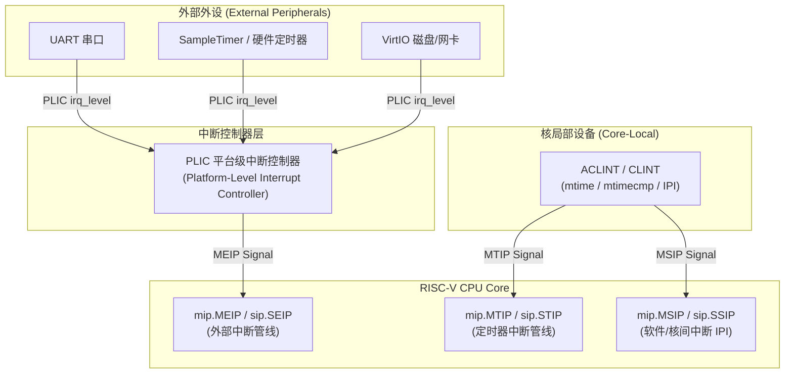
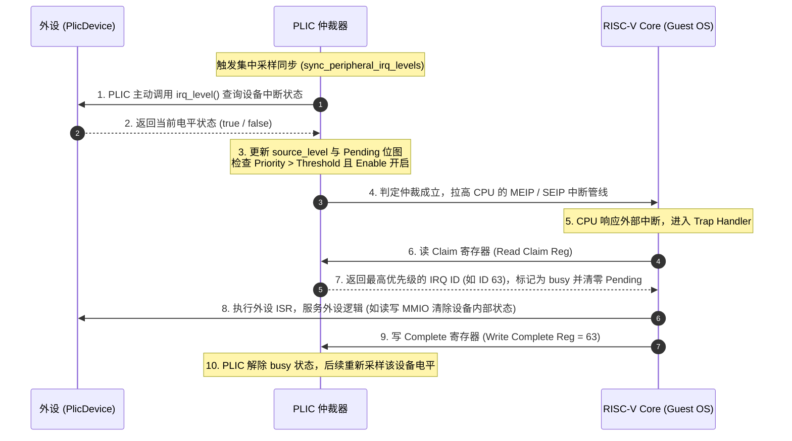
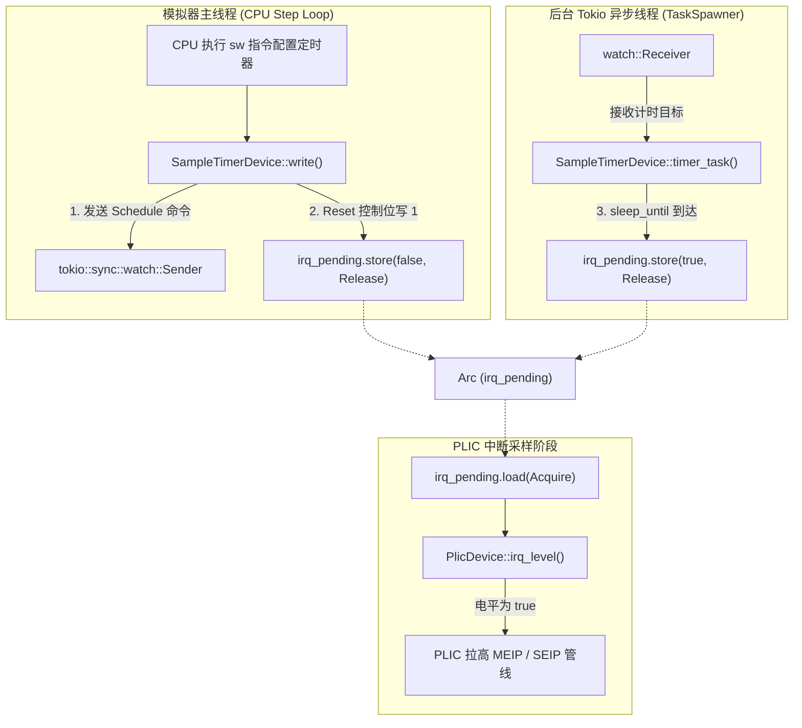
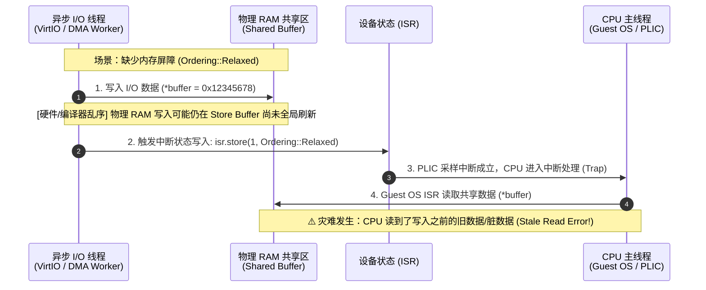
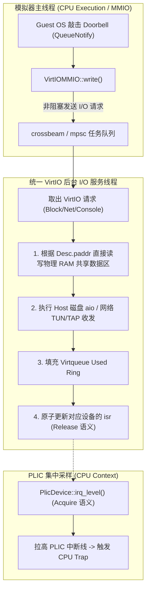
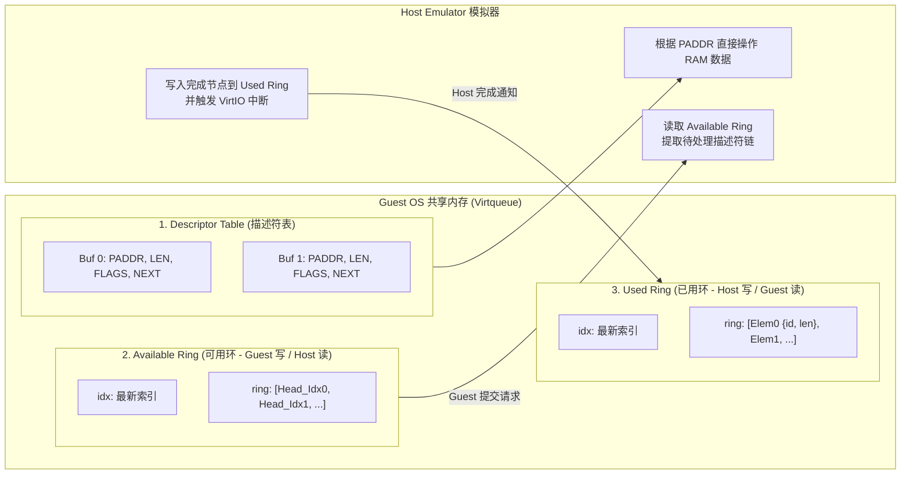
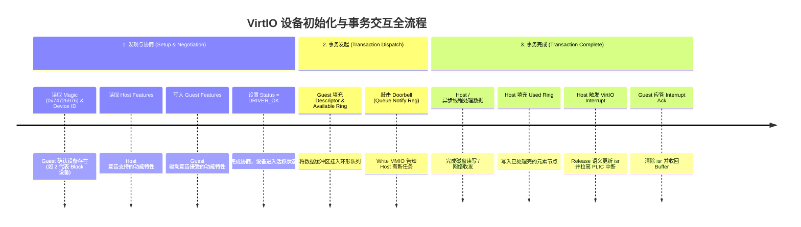

## 一. 本章概览

在现代计算机系统架构中，CPU 绝非孤立运转的算术引擎，它需要时刻与丰富的外围设备（Peripherals）交互：通过串口（UART）输出调试日志、通过定时器（Timer）触发任务调度、通过网卡与磁盘进行高速 I/O。

模拟器不仅要模拟 CPU 指令的执行，还需要构建一套高效、规范且支持并发的外设与中断抽象层。本章将带你深入 RISC-V 的中断体系拓扑（PLIC & ACLINT/CLINT），剖析模拟器的设备接口抽象（`DeviceTrait` 与统一电平采样接口 `PlicDevice`），解析基于 Tokio 运行时的异步任务分发机制（`TaskSpawner`），深入基于 VirtIO 规范的半虚拟化（Paravirtualization）机制与统一后台异步 I/O 线程设计，并最终引导你开发一个具有实际功能的系统级外设。

通过本章学习与实验，你将完成以下内容：
1. 理解 RISC-V 外部中断（PLIC）与局部中断（ACLINT/CLINT）的硬件拓扑及工作机制。
2. 掌握模拟器现代外设架构：`DeviceTrait` 设备接口、统一电平采样接口 `PlicDevice`，以及基于 Tokio 的 `TaskSpawner` 异步任务分发机制。
3. 掌握外设 DMA 与异步线程中的**内存屏障与可见性（Acquire-Release 语义）**，理解共享 RAM 数据区与 `isr` 中断状态同步的正确实现。
4. 理解 VirtIO 规范与半虚拟化机制：Virtqueue 共享环（Descriptor Table、Available Ring、Used Ring）、Feature 协商机制、Doorbell 门铃机制以及**统一 VirtIO 异步 I/O 后台线程**的设计模式。
5. **综合实验任务**：独立开发一个可直接被 Linux Kernel 内核驱动识别与使用的真实外设（如 VirtIO-Net、VirtIO-Console、VirtIO-RNG、GPIO 控制器、Watchdog 等）。

---

## 二. RISC-V 中断体系与 PLIC 工作机制

### 1. 中断拓扑与体系结构

在 RISC-V 系统架构中，中断按来源与作用域划分为两大核心子系统：



1. **核局部中断控制器（ACLINT / CLINT）**：
   - 负责生成处理器核本地的**定时器中断（Timer Interrupt, `MTIP`）**和**核间软件中断（Software Interrupt / IPI, `MSIP`）**。
   - 硬件寄存器 `mtime`（全局高精度计数器）和 `mtimecmp`（比较寄存器）直接映射在 MMIO 空间中。当 `mtime >= mtimecmp` 时，硬件自动拉高当前 Core 的 `MTIP` 管线。
2. **平台级中断控制器（PLIC）**：
   - 负责收集与仲裁系统中成百上千个外部设备（如 UART、网卡、VirtIO 设备）发出的**外部中断（External Interrupt, `MEIP`/`SEIP`）**。
   - PLIC 负责完成优先权仲裁，并将最高优先级的中断信号汇总输出给 CPU Core。

> [!TIP]
> 想深入探讨 RISC-V 体系结构基础，可参考：[问 AI：什么是 RISC-V，为什么要学习 RISC-V？](https://kimi.moonshot.cn/_prefill_chat?prefill_prompt=什么是riscv,为什么要学riscv&send_immediately=false&force_search=true)

---

### 2. PLIC 的核心工作机制

PLIC（Platform-Level Interrupt Controller）作为一个独立的硬件仲裁单元，内部维护了以下关键寄存器与状态机：

- **Priority（中断优先级寄存器）**：为每个外部中断源（IRQ ID）配置优先级（通常 0 表示禁用该中断，数值越大优先级越高）。
- **Pending（中断挂起位图）**：PLIC 采样到设备电平有效后，将对应的 Pending 位置 1，表示该中断正在等待处理。
- **Enable（中断使能位图）**：按 CPU Hart 与特权级（M-mode / S-mode Context）控制是否允许响应特定 IRQ ID。
- **Threshold（中断优先级阈值）**：只有优先级**严格大于** Threshold 的 Pending 中断才会被允许递交给 CPU。
- **Claim / Complete（中断响应与完成寄存器）**：CPU 读写该寄存器以完成与 PLIC 的握手交互。

PLIC 的中断服务完整生命周期如下图所示：



> [!TIP]
> 欲了解更多 PLIC 的寄存器偏移与硬件规范细节，可查阅：[问 AI：深入理解 RISC-V PLIC 中断控制器规范](https://kimi.moonshot.cn/_prefill_chat?prefill_prompt=详细解释RISC-V的PLIC中断控制器规范,包括Priority,Pending,Enable,Threshold,Claim和Complete机制&send_immediately=false&force_search=true) 或附录中的 `PLIC` 手册

---

## 三. 模拟器现代外设架构：`DeviceTrait` 与 `TaskSpawner`

在模拟器中，为了让外设既能优雅地挂载到地址总线（MMIO），又不会因为耗时 I/O 或异步事件阻塞 CPU 指令推进主线程，模拟器重构并采用了一套简洁统一的**设备接口抽象**与**异步任务派发框架**。

### 1. 核心设备抽象：`DeviceTrait` 与 `PlicDevice`

在 [src/device/mod.rs]($env.repo/tree/master/src/device/mod.rs) 中，模拟器定义了统一的外设与中断抽象：

```rust
pub trait DeviceTrait: 'static {
    fn read(&mut self, addr: WordType, len: u32) -> Result<u64, MemError>;
    fn write(&mut self, addr: WordType, len: u32, data: u64) -> Result<(), MemError>;
    fn sync(&mut self);
}

/// 支持被 PLIC 统一采样电平状态的外设接口
pub trait PlicDevice: DeviceTrait {
    /// 返回外设当前中断引脚的绝对电平状态 (Level-Triggered)
    fn irq_level(&mut self) -> bool;
}
```

- **`DeviceTrait`（基础外设接口）**：所有挂载到 `MemoryMapIO` 上的设备只需实现 `read` 和 `write`。宏定义为 `u8/u16/u32/u64` 提供了开箱即用的分发支持。
- **`PlicDevice`（统一电平采样接口）**：替代了以往复杂分散的 IRQ 抽象。所有具有外部中断能力的外设仅需实现 `irq_level(&mut self) -> bool`。
- **PLIC 集中采样（Centralized Level Sampling）**：
  在 [src/device/plic/mod.rs]($env.repo/tree/master/src/device/plic/mod.rs) 中，PLIC 维护了已注册设备的数组 `peripheral_irq_devices: [Option<NonNull<dyn PlicDevice>>; VIRT_MAX_INTERRUPTS]`。在每次 CPU 读写 Claim/Complete 或刷新中断管线时，PLIC 通过 `sync_peripheral_irq_levels()` 统一调用每个设备的 `irq_level()`，直接反映真实的硬件电平触发逻辑，杜绝了边缘触发丢失与状态不一致的问题。

---

### 2. 异步任务运行时：`TaskSpawner` 与 Tokio 框架

在全系统模拟器中，CPU 主循环（`step_batch` / `step_impl`）运行在主线程上，以极高的频率逐条取指并推进模拟时钟。如果某个外设需要等待一段时间（如定时器超时、串口传输延迟）或处理阻塞式 I/O（如网络数据收发、磁盘镜像读写），如果在主线程中直接调用 `thread::sleep` 或同步阻塞 I/O，**将彻底冻结 CPU 的指令执行**。

为了解决这一问题，模拟器将外设的耗时操作与异步事件解耦至后台的 **Tokio 异步运行时**。

#### 什么是 Tokio？

[Tokio](https://tokio.rs/) 是 Rust 生态中最流行、工业级成熟的事件驱动异步运行时（Asynchronous Runtime）。它提供了：
1. **轻量级异步多任务（Tasks）**：类似于操作系统线程，但由用户态协程调度器管理，创建和切换开销极小，单个线程内即可并发运行成千上万个轻量任务。
2. **高精度异步定时器（`tokio::time`）**：支持毫秒/微秒级非阻塞定时等待（如 `sleep`、`sleep_until`），在等待期间让出 CPU 给其他任务执行。
3. **丰富的并发通信原语（Channels）**：提供了单生产者单消费者（`oneshot`）、多生产者单消费者（`mpsc`）、多广播通道（`broadcast`）以及单一状态观察通道（`watch`）等跨任务同步机制。
4. **事件驱动 I/O（Reactor 反应器模型）**：底层封装了 OS 的多路复用接口（Linux 的 `epoll`、macOS 的 `kqueue`、Windows 的 `IOCP`），支持高吞吐网络与文件并发读写。

- [Tokio 官方文档](https://tokio.rs/)
- [Tokio API 查阅 (docs.rs)](https://docs.rs/tokio)

> [!TIP]
> 想深入探讨 Rust 异步编程与 Tokio 底层机制，可参考：[问 AI：深入理解 Rust Tokio 异步运行时与事件驱动模型](https://kimi.moonshot.cn/_prefill_chat?prefill_prompt=详细解释Rust的Tokio异步运行时工作原理,Reactor与Executor模型,异步任务Task,通道Channel以及如何在同步模拟器中嵌入Tokio事件循环&send_immediately=false&force_search=true)

#### 模拟器的 `TaskSpawner` 设计

在 [src/task_spawner.rs]($env.repo/tree/master/src/task_spawner.rs) 中，模拟器构建了一个轻量级的任务派发器 `TaskSpawner`，它在后台维护一个独立的单线程 Tokio 运行时：

```rust
pub struct TaskSpawner {
    spawn: mpsc::Sender<TaskFuture>,
}

impl TaskSpawner {
    pub fn new() -> TaskSpawner {
        let (send, mut recv) = mpsc::channel(64);
        let runtime = Builder::new_current_thread().enable_all().build().unwrap();

        // 启动后台独立的 Tokio 异步事件驱动线程
        std::thread::spawn(move || {
            runtime.block_on(async move {
                let mut tasks = Vec::new();
                while let Some(task) = recv.recv().await {
                    tasks.push(tokio::spawn(task));
                }
                for task in tasks {
                    let _ = task.await;
                }
            });
        });

        TaskSpawner { spawn: send }
    }

    pub fn spawn_task(&self, task: TaskFuture) {
        self.spawn.try_send(task).expect("Failed to spawn async task");
    }
}
```

- **非阻塞主线程**：模拟器 CPU 主循环在执行 MMIO 读写时，只需将异步 Future 通过 `spawner.spawn_task(...)` 发送给后台线程，立即返回，保证 CPU 步进主线程的高性能与低延迟。

---

### 3. SampleTimer 外设源码导读

[src/device/sample_timer.rs]($env.repo/tree/master/src/device/sample_timer.rs) 是模拟器提供的一个完整的毫秒级测试定时器外设。它清晰地演示了 **MMIO 寄存器配置**、**`TaskSpawner` 异步计时** 与 **`PlicDevice` 电平报告** 的协同工作流：



#### 核心源码解析

1. **设备初始化与后台任务挂载**：
   在 `SampleTimerDevice::new` 中，利用 `watch::channel` 创建命令通道，并通过 `spawner.spawn_task` 将 `timer_task` 注册进 Tokio 后台运行时：
   ```rust
   pub fn new(spawner: TaskSpawner) -> Self {
       let (tx, rx) = watch::channel(TimerCommand::Cancel);
       let irq_pending = Arc::new(AtomicBool::new(false));

       spawner.spawn_task(Box::pin(Self::timer_task(rx, irq_pending.clone())));

       Self {
           layout: SampleTimerLayout::new(),
           irq_pending,
           sender: tx,
       }
   }
   ```
2. **异步定时等待（`timer_task`）**：
   后台异步任务使用 `tokio::select!` 同时监听控制命令变化与定时器超时事件：
   ```rust
   async fn timer_task(mut rx: watch::Receiver<TimerCommand>, irq_pending: Arc<AtomicBool>) {
       let mut command = TimerCommand::Cancel;
       loop {
           match command {
               TimerCommand::Schedule(deadline) => tokio::select! {
                   result = rx.changed() => {
                       if result.is_err() { return; }
                       command = *rx.borrow();
                   }
                   _ = tokio::time::sleep_until(deadline) => {
                       // 定时到达：原子置位 irq_pending (Release 语义)
                       irq_pending.store(true, Ordering::Release);
                       command = TimerCommand::Cancel;
                   }
               },
               TimerCommand::Cancel => {
                   if rx.changed().await.is_err() { return; }
                   command = *rx.borrow();
               }
           }
       }
   }
   ```
3. **电平状态接入（`PlicDevice`）**：
   ```rust
   impl PlicDevice for SampleTimerDevice {
       fn irq_level(&mut self) -> bool {
           self.irq_pending.load(Ordering::Acquire) && (self.layout.interrupt_mask_reg & 1) == 1
       }
   }
   ```

---

## 四. 内存屏障、可见性与 VirtIO 统一异步 I/O 架构

在编写具有 DMA（Direct Memory Access）能力或带异步 Backend 的外设（例如串口读写, 磁盘读取、网卡接收包、VirtIO 队列处理）时，必须严格处理**跨线程内存可见性**。

### 1. 内存乱序与可见性陷阱（Memory Visibility & Reordering）



如果没有施加正确的内存屏障，后台线程对 RAM 缓冲区的物理写入可能还在 CPU Store Buffer 或宿主高速缓存中尚未全局刷新，而中断标志已经被主线程观察到并进入 ISR，导致 Guest OS 读取到未初始化的脏数据。

#### 解决方案：`Acquire-Release` 语义配对

- **后台写入线程（Release 语义）**：
  在完成对共享 RAM 数据区的所有操作后，以 **`Ordering::Release`**（或 `Ordering::AcqRel`）写入设备中断状态寄存器（`isr`）：
  ```rust
  // 1. 完成所有 RAM 数据操作 ...
  // 2. 附加 Release 语义置位 isr，确保 RAM 操作先于 isr 的写入对外部可见
  self.isr.fetch_or(1, Ordering::Release);
  ```
- **PLIC / 主线程采样（Acquire 语义）**：
  在 `irq_level()` 中以 **`Ordering::Acquire`** 读取 `isr`：
  ```rust
  impl PlicDevice for VirtIODevice {
      fn irq_level(&mut self) -> bool {
          self.isr.load(Ordering::Acquire) != 0 && self.queue.interrupts_enabled()
      }
  }
  ```
- **同步保证（Synchronizes-With）**：
  根据 C++11 / Rust 内存模型，`Release Store` 与 `Acquire Load` 之间建立起强烈的内存屏障，**确保异步线程在写 `isr` 之前对共享 RAM 区域所做的所有内存修改，在 CPU 观察到中断电平为 `true` 之后绝对全局可见！**

---

### 2. VirtIO 统一后台异步 I/O 线程架构

> [!NOTE]
> VirtIO 异步行为刚刚实现, 可能还不稳定, 请批判性的分析源码, 有问题大胆提交 issue.

在 VirtIO 的工业级模拟中，如果每个 VirtIO 设备（Block 磁盘、Net 网卡、Console、FS）都独占启动一个后台线程，会导致宿主系统线程频繁上下文切换与资源浪费。最优架构是构建一个**统一的 VirtIO 后台 I/O 服务线程（Unified VirtIO Background Thread）**：



#### 架构核心要点：
1. **单一 Tasks 统一调度**：提供一个统一的后台 I/O 线程，集中管理所有设备的队列任务。
2. **直接操作物理 RAM**：异步线程根据描述符表提供的物理地址（`paddr`）直接切片操作宿主分配的 RAM 内存块。
3. **安全的中断递交**：I/O 完成并回写 Used Ring 后，原子执行 `isr.fetch_or(1, Ordering::Release)`。主线程 PLIC 在下一次周期检查时通过 `Acquire` 读观察到中断，无缝触发 Guest 内核驱动。

---

## 五. VirtIO 规范与半虚拟化机制

在真实物理世界中，模拟一套复杂的真实硬件（如 Intel e1000 网卡或 NVMe 控制器）需要模拟成百上千个复杂的寄存器，导致频繁且昂贵的 VM-Exit 陷入开销。为此，现代虚拟化技术广泛采用了 **VirtIO 半虚拟化（Paravirtualization）标准**。

> [!TIP]
> 想了解 VirtIO 规范的演进与底层细节，可以[问 AI：深入理解 VirtIO 规范与半虚拟化机制](https://kimi.moonshot.cn/_prefill_chat?prefill_prompt=深入解释VirtIO规范,Split%20Virtqueue结构,Available%20Ring,Used%20Ring,Doorbell门铃机制与半虚拟化工作原理&send_immediately=false&force_search=true)

### 1. 半虚拟化 (Paravirtualization) vs 全虚拟化 (Full Virtualization)

- **全虚拟化 (Full Virtualization / Trap & Emulate)**：
  Guest OS 无需修改，使用原生的物理设备驱动。Guest 每读写一次外设寄存器，都会触发一次内存访问异常，导致 CPU **陷入（Trap-out）** 到模拟器，模拟器处理完状态后再 **陷回（Trap-in）** Guest。由于陷入陷出涉及昂贵的上下文切换，性能极差。
- **半虚拟化 (Paravirtualization / VirtIO)**：
  Guest OS 知道自己运行在虚拟机中，装载专用的 VirtIO 驱动。Guest 与 Host 约定一块**共享物理内存（Virtqueue 环形缓冲区）**。Guest 批量准备好成百上千个数据包后，只需触发一次 **门铃（Doorbell）** 寄存器通知 Host，极大减少了陷入陷出次数，接近物理硬件性能！

---

### 2. VirtIO 核心机制：Virtqueue 与 Ring 结构

VirtIO 的核心数据传输结构称为 **Virtqueue**。Split Virtqueue 由三部分共享内存数组组成：



1. **Descriptor Table（描述符表）**：记录每一块数据缓冲区的物理地址 `paddr`、长度 `len`、读写标志 `flags` 以及链式下一项指针 `next`。
2. **Available Ring（可用环）**：由 **Guest 写入，Host 读取**。Guest 将填好数据的描述符链头索引写入 Available Ring，通知 Host“有新请求待处理”。
3. **Used Ring（已用环）**：由 **Host 写入，Guest 读取**。Host 完成 I/O 操作（如从磁盘读出数据填充到描述符缓冲区）后，将描述符索引与写入长度填入 Used Ring，通知 Guest“请求已完成”。

---

### 3. Feature 协商与事务全生命周期

VirtIO 设备的初始化与事务处理遵循严格的状态机协商机制：



---

## 六. 项目导览

- **外设 Trait 抽象定义**：[src/device/mod.rs]($env.repo/tree/master/src/device/mod.rs)（定义基础外设接口 `DeviceTrait` 与 PLIC 采样接口 `PlicDevice`）
- **异步任务运行时**：[src/task_spawner.rs]($env.repo/tree/master/src/task_spawner.rs)（基于 Tokio 的后台异步任务派发器 `TaskSpawner`）
- **MMIO 总线与地址映射**：[src/device/mmio.rs]($env.repo/tree/master/src/device/mmio.rs)（`MemoryMapIO` 实现物理地址重定向与读写分发）
- **外设地址布局配置**：[src/device/config.rs]($env.repo/tree/master/src/device/config.rs)（定义基地址 `BASE` 与内存大小 `SIZE`）
- **ACLINT / CLINT 定时器**：[src/device/aclint.rs]($env.repo/tree/master/src/device/aclint.rs)（`mtime` / `mtimecmp` 与 `MTIP` / `MSIP` 局部中断）
- **PLIC 中断控制器**：[src/device/plic/mod.rs]($env.repo/tree/master/src/device/plic/mod.rs)（外部中断仲裁、Claim / Complete 握手与 `PlicDevice` 电平集中采样）
- **SampleTimer 参考外设**：[src/device/sample_timer.rs]($env.repo/tree/master/src/device/sample_timer.rs)（演示 `TaskSpawner`、`watch::channel` 与 `PlicDevice` 电平报告的完整定时器）
- **VirtIO MMIO 传输层**：[src/device/virtio/virtio_mmio.rs]($env.repo/tree/master/src/device/virtio/virtio_mmio.rs)（VirtIO 控制寄存器、Feature 协商与 Doorbell 门铃机制）
- **Virtqueue 队列机制**：[src/device/virtio/virtio_queue.rs]($env.repo/tree/master/src/device/virtio/virtio_queue.rs)（Descriptor Table、Available Ring 与 Used Ring 共享内存实现）
- **VirtIO Block 设备实现**：[src/device/virtio/virtio_blk.rs]($env.repo/tree/master/src/device/virtio/virtio_blk.rs)（半虚拟化块设备参考实现, 支持异步io）
- **板卡总线与 IRQ 连接**：[src/board/virt.rs]($env.repo/tree/master/src/board/virt.rs)（板卡外设初始化、`TaskSpawner` 注入与 PLIC 中断管线挂载）

---

## 七. 综合实验任务：开发一个实际功能的系统外设

在本实验中，你将独立设计并实现一个**具备实际应用价值的系统级外设**，并将其挂载到模拟器的 MMIO 地址空间，使其能够被 Linux 操作系统内核直接识别并正常工作！

### 1. 推荐选题方向（均支持 Linux 内核驱动识别）

你可以根据个人兴趣从以下项目中选择一个进行实现：

| 选题名称                  | 规范与类型                 | 核心挑战与特色                                                                                              | 验证方式                             |
| ------------------------- | -------------------------- | ----------------------------------------------------------------------------------------------------------- | ------------------------------------ |
| **VirtIO-Console**        | VirtIO (Device ID 3)       | 实现半虚拟化控制台，支持控制台输入输出                                                                      | Linux 开机输出 `/dev/hvc0`           |
| **VirtIO-Net**            | VirtIO (Device ID 1)       | 结合 TAP/TUN 宿主网卡，实现网络收发包                                                                       | Linux 内核中 `ping` 联通网络         |
| **VirtIO-FS / VirtIO-9P** | VirtIO (Device ID 26 / 9P) | 实现文件系统共享，将宿主目录挂载入虚拟机                                                                    | Linux 中 `mount -t 9p` 读写宿主文件  |
| **VirtIO-RNG**            | VirtIO (Device ID 4)       | 硬件随机数生成器，响应熵池读取                                                                              | Linux 中 `cat /dev/hwrng` 获取随机数 |
| **GPIO 控制器**           | 自定义 MMIO 设备           | 实现数字输入输出管脚；可通过模拟器终端 `Ctrl+A` 命令模式输入 `1`/`0` 模拟引脚电平变化，并在终端打印日志输出 | 裸机/Linux 驱动中读写 GPIO 寄存器    |
| **I2C Adapter**           | 自定义 MMIO / I2C 总线     | 实现 I2C 总线控制器，并在总线上挂载虚拟 LED 点阵或传感器                                                    | 读写 I2C 寄存器控制子设备            |
| **Watchdog Timer**        | 自定义 MMIO 定时器         | 实现看门狗倒计时，超时未“喂狗”触发系统复位或中断                                                            | 编写测试程序验证看门狗复位           |
| **RGB 颜色输出设备**      | 自定义 MMIO 显示设备       | 接收 RGB888 像素数据，并在终端中显示 ANSI 彩色块输出                                                        | 在终端中打印彩色图像/图案            |

> [!NOTE]
> 强烈推荐优先尝试 **VirtIO 系列设备** 或 **GPIO / Watchdog** 设备。VirtIO 设备可以无缝使用 Linux Kernel 内置的标准驱动，无需自己为 Linux 编写内核模块！并且当前 `HERE` 模拟器已经实现了完整的 `VirtIOMMIO` 总线协议与 Virtqueue 解析，添加新设备相对清晰规整。

---

### 2. 实验要求与实现指导

1. **设备映射与总线注册**：
   在 [src/device/config.rs]($env.repo/tree/master/src/device/config.rs) 中配置新外设的 MMIO 基地址 `BASE` 与 `SIZE`，为你的外设结构体实现 `DeviceTrait`。
2. **接入 PLIC 中断采样（`PlicDevice`）**：
   若外设支持外部中断，为其实现 `PlicDevice` Trait：
   ```rust
   impl PlicDevice for MyDevice {
       fn irq_level(&mut self) -> bool {
           self.irq_asserted.load(Ordering::Acquire)
       }
   }
   ```
   并在 [src/board/virt.rs]($env.repo/tree/master/src/board/virt.rs) 中分配 `PeriphIrqId` 并向 PLIC 注册该设备。
3. **异步并发任务使用 `TaskSpawner`**：
   若外设需要异步计时、延时或非阻塞 I/O，通过构造函数注入 `TaskSpawner`，使用 `spawner.spawn_task(...)` 派发异步任务，严禁阻塞模拟器主 CPU 线程。
4. **DMA 与共享 RAM 内存屏障保障**：
   若外设直接在后台线程操作模拟器物理 RAM（如 Virtqueue 描述符读写或数据包搬运），必须在写完共享 RAM 后，以 `Ordering::Release` 原子更新中断标志寄存器（`isr` 或 `irq_pending`），确保 Guest OS 观察到中断时，数据已在物理 RAM 中完全就绪。
