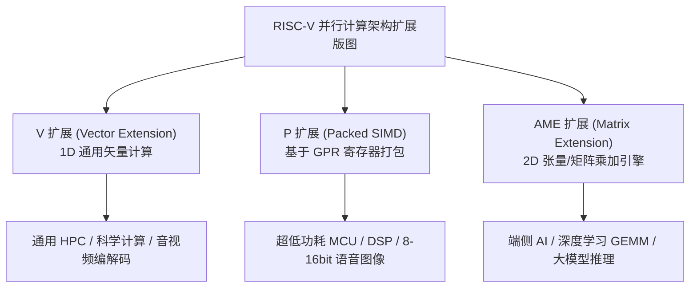

[REPO]: https://github.com/WanDejun/riscv-emulator

## 本章概览

随着端侧 AI（Edge AI）、本地大模型（Local LLM）推理、计算机视觉与音视频处理技术的爆发式发展，传统的标量处理架构（Scalar Processing）在面对海量高吞吐量的数据计算时显得力不从心。**SIMD（Single Instruction Multiple Data，单指令多数据）** 及其演进出的**矢量计算（Vector Processing）** 与 **矩阵计算（Matrix Engine）** 架构，成为了现代芯片算力提升的关键所在。

RISC-V 体系结构通过 **V 扩展（Vector Extension）**、处于草案阶段的 **P 扩展（Packed SIMD）** 以及 **AME 扩展（Advanced Matrix Extension）** 构建起了完整的并行计算版图。

通过本章学习与实验，你将完成以下内容：
1. 理解 SIMD 与 RISC-V V 扩展（VLA 可变向量长度）的核心原理及其在端侧 AI 算力加速中的关键作用。
2. 了解 RISC-V Packed-SIMD (P) 扩展与 AME 矩阵扩展的设计初衷与应用场景（相关手册仓库见 [Appendix_A.md](REPO/tree/master/rv-exp/Appendix_A.md)）。
3. 掌握模拟器当前对 RVV 1.0 整型向量指令集的支持情况。
4. **实验任务**：编写简单的 RISC-V 向量 C/汇编程序（如向量点积 Dot Product、整型 GEMM 矩阵乘法算子），并在模拟器中运行验证。

---

## 一、 SIMD 概念与 RISC-V V 扩展标准

### 1. 什么是 SIMD？为何端侧 AI 极其依赖它？

在传统标量（Scalar）计算中，一条 `add` 指令只能完成一对 32 位整数的加法；而在 SIMD/向量计算中，一条向量加法指令 `vadd.vv` 可以同时对寄存器中由数十乃至数百个元素构成的数组进行并行运算。

想深入探讨 SIMD 与端侧 AI 算力加速的关联，可参考：[问 AI：深入理解 SIMD 指令集与 RISC-V 向量扩展在端侧 AI 中的应用](https://kimi.moonshot.cn/_prefill_chat?prefill_prompt=详细解释什么是SIMD单指令多数据原理,RISC-V%20Vector扩展的设计优势以及SIMD在端侧AI大模型推理中的重要作用&send_immediately=true&force_search=true)

```text
标量计算 (Scalar Add):
  a0 ────► [   10   ]
                +      ──► c0 ──► [   30   ]
  b0 ────► [   20   ]

SIMD / 向量计算 (Vector Add - vadd.vv):
  v1 ────► [ 10 | 20 | 30 | 40 ]
                +   +    +    +    ──► v3 ──► [ 15 | 25 | 35 | 45 ]
  v2 ────► [  5 |  5 |  5 |  5 ]
```

在端侧 AI 深度学习推理（如 MobileNet 图像分类、Whisper 语音识别、Llama 边缘大模型）中，绝大部分计算开销都集中在 **矩阵乘法（GEMM）**、**卷积（Convolution）** 与 **张量点积（Dot Product）** 上。SIMD 架构能够在不增加晶体管取指/译码开销的前提下，将计算吞吐量提升数倍至数百倍，极大降低能耗。

---

### 2. RISC-V V 扩展（Vector Extension）的设计精髓

与 x86 AVX（固定 128/256/512 位）或 ARM Neon（固定 128 位）不同，RISC-V V 扩展采用了全新的 **VLA（Vector Length Agnostic，矢量长度无关）** 设计模式。

#### 核心优势与 CSR 寄存器

1. **写一次代码，到处运行（VLA 机制）**：
   开发者编写向量代码时无需绑定具体的物理硬件寄存器长度（`VLEN`）。无论是在 128 位嵌入式 MCU 还是 4096 位超算 Vector Engine 上，同样的二进制代码均可自动发挥最佳性能。
2. **核心控制 CSR 寄存器**：
   - **`vtype`（向量类型寄存器）**：
     - `SEW` (Selected Element Width)：选择当前向量元素位宽（如 8-bit, 16-bit, 32-bit, 64-bit）。
     - `LMUL` (Length Multiplier)：向量寄存器分组倍率（可将多个向量寄存器组合成 `LMUL=2, 4, 8` 的组，从而获得更大的向量容量）。
     - `ta` / `ma`：尾部/掩码无感知（Tail/Mask Agnostic）控制。
   - **`vl`（当前向量元素长度）**：表示当前指令实际处理的元素个数，由 `vsetvli` 指令根据硬件容量动态配置。

指令配置示例：
```assembly
# 动态配置处理 SEW=32 (32-bit 整数), LMUL=1 的向量
vsetvli t0, a0, e32, m1, ta, ma
```

---

### 3. 本模拟器对 V 扩展的支持状态说明

在本项目模拟器中（源码位于 [src/isa/riscv/vector/](REPO/tree/master/src/isa/riscv/vector/)）：

> [!IMPORTANT]
> **模拟器向量扩展实现状态**：
> 1. 模拟器支持 RISC-V V 扩展 1.0 标准的核心**整型向量指令集**（包含 `vadd.vv/vx/vi`, `vsub`, `vmul`, `vslide1up`, `vslide1down`, `vsetvli` 等）。
> 2. **限制声明**：模拟器目前**尚未提供对浮点向量指令（Floating-Point Vector Instructions）的支持**。在进行向量编程和实验时，请使用整型数据（INT8 / INT16 / INT32）类型。

---

## 二、 衍生扩展：AME 矩阵扩展与 P 扩展

除了通用 1D 向量扩展（V 扩展）外，RISC-V 社区还在火热推进行业专用的并行扩展提案（手册规范已收录于 [Appendix_A.md](REPO/tree/master/rv-exp/Appendix_A.md)）：



### 1. P 扩展 (Packed SIMD Extension)

- **设计初衷**：在不需要引入额外大面积向量寄存器堆（Vector Registers）的前提下，直接复用标准的 32 位或 64 位通用整型寄存器（GPR）。
- **工作机制**：将一个 64 位寄存器“打包”看作 8 个 8 位整数或 4 个 16 位整数，通过单条指令完成 8-way 并行加法或乘加。
- **适用场景**：超低功耗 IoT 芯片、DSP 信号处理、基础像素/语音算子。
- **规范仓库**：[RISC-V P 扩展手册](https://github.com/riscv/riscv-p-spec)

---

### 2. AME 扩展 (Advanced Matrix Extension / 矩阵扩展)

- **设计初衷**：为了应对 Transformer / 卷积神经网络中密集的二维矩阵乘法（GEMM：$C = A \times B + C$），1D 矢量扩展需要频繁进行规约与转置。AME 扩展直接在硬件层引入了 **2D 矩阵寄存器（Tile Registers）**。
- **工作机制**：单条矩阵指令可在一组 Tile 寄存器间完成二维收缩乘加，极大提高了数据复用率与 MAC（Multiplier-Accumulator）算力密度。
- **适用场景**：AI 加速卡、端侧 NPU、大语言模型矩阵乘法硬件加速。
- **规范仓库**：[RISC-V AME 矩阵扩展手册](https://github.com/riscv/riscv-matrix-extension)

---

## 三、 实验任务：编写与运行 SIMD 算子代码

本实验要求你利用模拟器支持的整型向量指令，编写简单的矢量化计算算子，并在模拟器/单元测试中验证其正确性。

### 1. 实验小任务一：向量点积（Vector Dot Product）

向量点积公式为：
$$\text{DotProduct}(A, B) = \sum_{i=0}^{N-1} A[i] \times B[i]$$

在 C / 内嵌汇编中，使用向量指令实现整型向量点积算法：

```c
#include <stdint.h>
#include <stddef.h>

// 使用 RISC-V 向量指令计算 32 位整型向量点积
int32_t vector_dot_product_int32(const int32_t *a, const int32_t *b, size_t n) {
    int32_t sum = 0;
    size_t vl;
    
    for (; n > 0; n -= vl, a += vl, b += vl) {
        // 1. 动态配置向量长度 (SEW=32, LMUL=1)
        asm volatile ("vsetvli %0, %1, e32, m1, ta, ma" : "=r"(vl) : "r"(n));
        
        // 2. 将数组 a 和 b 加载入向量寄存器 v1, v2 (伪代码/内嵌汇编)
        // 3. 执行向量乘法与规约累加
    }
    
    return sum;
}
```

---

### 2. 实验小任务二：整型矩阵乘法算子 (INT32 GEMM)

实现一个基于向量指令加速的 $2 \times 2$ 或 $4 \times 4$ 整型矩阵乘法 $C = A \times B$：

$$C_{i,j} = \sum_{k} A_{i,k} \times B_{k,j}$$

在计算 $C$ 的每一行时，将矩阵 $B$ 的对应行加载入向量寄存器，使用向量标量乘加指令（`vwmacc` 或 `vmul` + `vadd`）批量更新结果矩阵的行向量，体会向量并行计算相比嵌套循环标量代码的效率提升。

---

### 3. 在模拟器与单元测试中验证

项目在 [src/isa/riscv/vector/arithmetic/integer_test.rs](REPO/tree/master/src/isa/riscv/vector/arithmetic/integer_test.rs) 中提供了大量整型向量算术测试用例（如 `test_vector_op_vadd_vv`）。

你可以通过以下命令在模拟器上运行向量单元测试：

```bash
cargo test vector_op
```

---

## 项目导览

- **向量寄存器与类型定义**：[src/isa/riscv/vector/types.rs](REPO/tree/master/src/isa/riscv/vector/types.rs)（定义 `Vlmul`, `Vsew`, `Vector` 结构体）
- **向量模块核心调度**：[src/isa/riscv/vector/mod.rs](REPO/tree/master/src/isa/riscv/vector/mod.rs)
- **整型向量指令实现**：[src/isa/riscv/vector/arithmetic/integer_impl.rs](REPO/tree/master/src/isa/riscv/vector/arithmetic/integer_impl.rs)
- **定点向量指令实现**：[src/isa/riscv/vector/arithmetic/fix_point_impl.rs](REPO/tree/master/src/isa/riscv/vector/arithmetic/fix_point_impl.rs)
- **向量单元测试套件**：[src/isa/riscv/vector/arithmetic/integer_test.rs](REPO/tree/master/src/isa/riscv/vector/arithmetic/integer_test.rs)
- **附录拓展资料库**：[Appendix_A.md](REPO/tree/master/rv-exp/Appendix_A.md)
